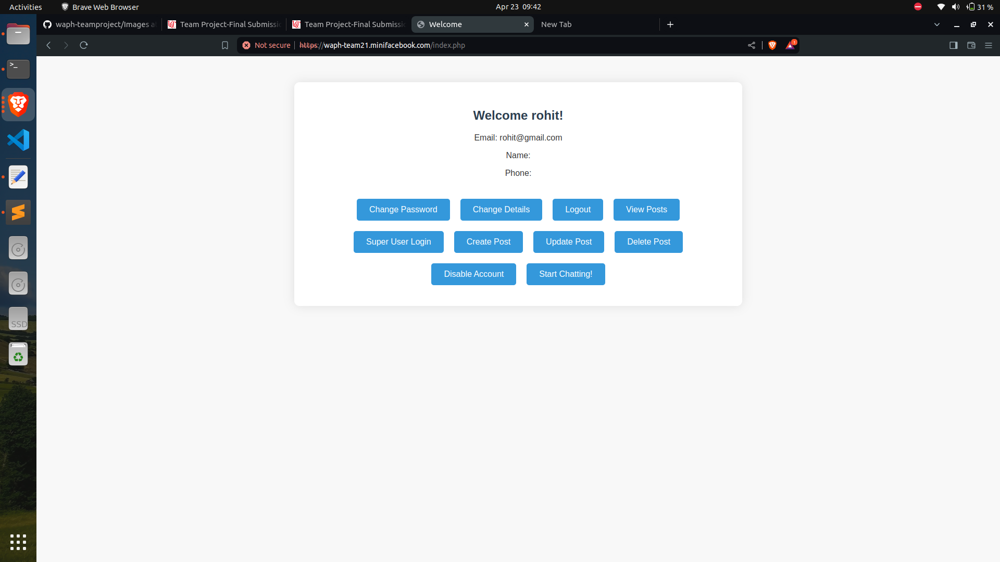
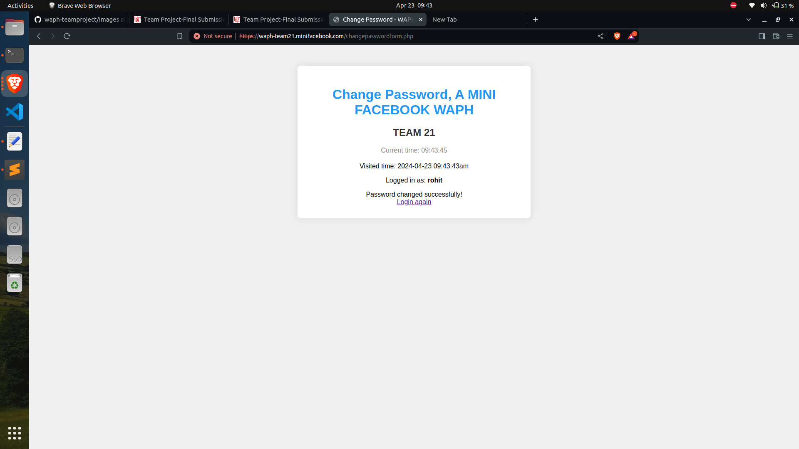
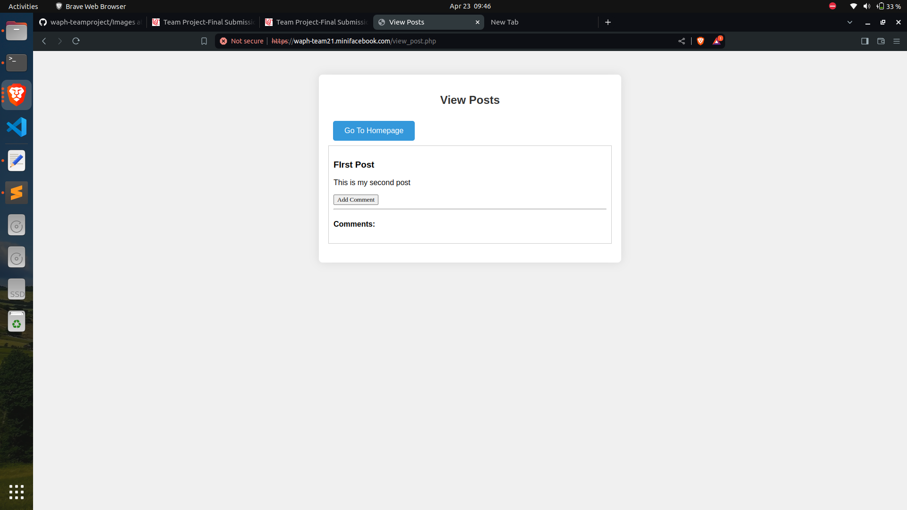
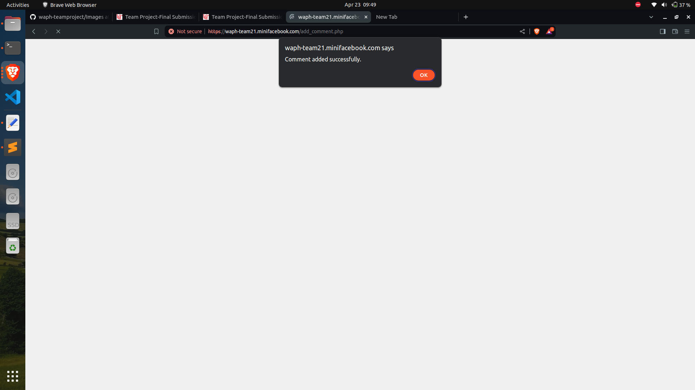
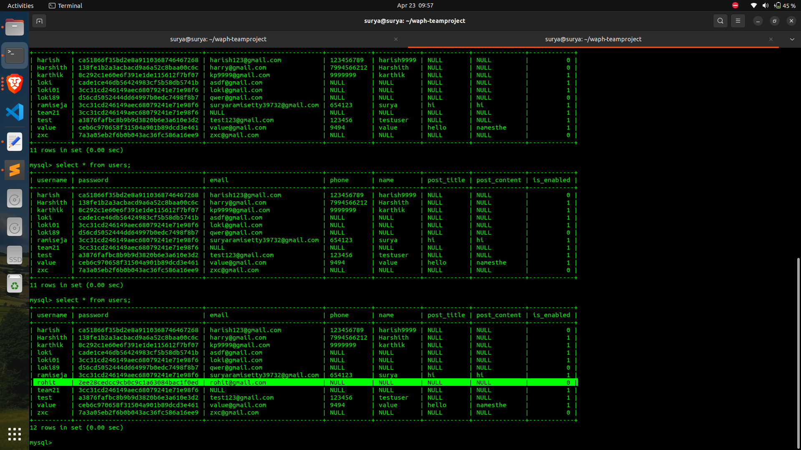
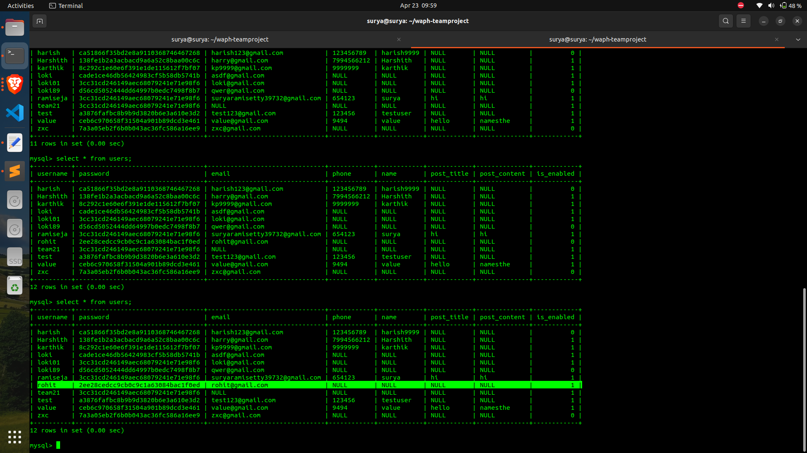
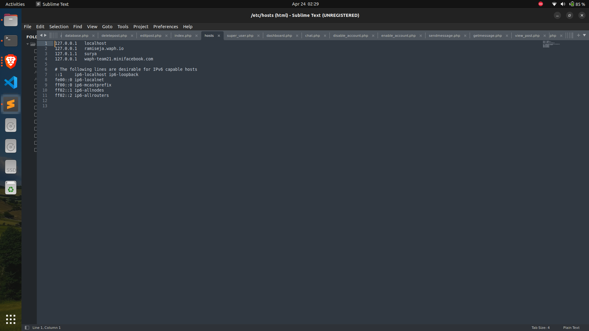
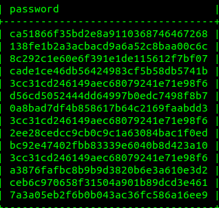

# WAPH-Web Application Programming and Hacking

## Instructor: Dr. Phu Phung

# Project Topic/Title: A MINI FACEBOOK

# Team members

1. Jaya Surya Ramisetty, ramiseja@mail.uc.edu
2. Karthik Pavuluri, pavulukk@mail.uc.edu
3. Purna Lokesh Reddy Chimalamarri, chimalpy@mail.uc.edu
4. Chakravarthi Maddi, maddici@mail.uc.edu

# Project Management Information

Source code repository (private access): (https://github.com/waph-team21/waph-teamproject.git)

Project homepage (public): (https://github.com/waph-team21/waph-team21.github.io.git)


# Implementation and demos:

- Anyone can register for an account: 


- Logged-in users can:

- login:
  

- Change password:
  

-Add a new post:
 
 
 
- Edit their own posts:
   
  

- Delete their own posts:
 

-Add comments on any post, e.g, by their own or others:
  
  

-Can have real-time chat with others*:


- Superusers can:
- Login (with the account added directly in the database):
  
  
  

-View the list of registered users.:


-Disable (not delete) a registered user*:



-Enable a registered user*:





# Security and Non-Functional Requirements: 

- the system must be deployed on HTTPS:

  


-Passwords must be hashed in the database and no MySQL root account used for the PHP code:



- All SQL must be in Prepared Statements:

- Data entered by the user can be separated from the SQL query itself using prepared statements. This is essential for stopping SQL injection attacks, which happen when erroneous SQL code is added to application queries, giving the attacker access to see or change database information.

- ```sql
  
  $prepared_sql = "INSERT INTO posts (content, author) VALUES (?, ?)"; 
  $stmt = $mysqli->prepare($prepared_sql);
  $stmt->bind_param('ss', $content, $author);
  ```
- HTML outputs must be sanitized:

  ``` sql
  if (isset($_POST["username"]) and isset($_POST["password"])) {

      if (checklogin_mysql($_POST["username"],$_POST["password"])) {

        $_SESSION['authenticated'] = TRUE;
        $_SESSION['username']= $_POST["username"];
    //$sanitized_username = htmlspecialchars($_POST['username'])
      }else{
        session_destroy();
        echo "<script>alert('Invalid username/password');window.location='form.php';</script>";
        die();
  }
  }
  if (!isset($_SESSION['authenticated']) or $_SESSION['authenticated']!= TRUE){
   session_destroy();
   echo "<script>alert('you have not login.please login')</script>";
   header("Refresh: 0; url=form.php");
   die();
  }
  if (!isset($_SESSION['authenticated']) || $_SESSION['authenticated'] !== true) {
    echo "<script>alert('Not authorized. Please login first.'); window.location='form.php';</script>";
    exit;
  }
   ```

- Role-based access control for registered users and super users:

Management of sessions:

Calling session_start() at the beginning of the code opens a PHP session.
This enables user-related data to be stored and retrieved by the programme across many pages.


Method of authentication:

The code determines whether the request method—which denotes a form submission—is POST.
From the POST data, it obtains the password and username that were submitted.
The given credentials are compared to hardcoded super user credentials.

Assigning roles:

The code stores the username and sets session variables to indicate successful authentication if the given credentials match those of the super user:

'authenticated' in $_SESSION['] = true;
$username = $_SESSION['username'];


Control of access:

After the login process is completed, the code takes the user to dashboard.php.
To restrict access to only authorised super users, the dashboard page can verify the session variables ($_SESSION['authenticated'] and $_SESSION['username']).


Error management

An error message is saved in the $loginError variable and shown on the login page if the credentials submitted are invalid.


Results:

An HTML form for super user login is generated by the code.
If there is an error message, it is displayed within the form.
The form sends the credentials it receives (super_user.php) to the same file for authentication.
Password hashing: Before being stored in a database, passwords should be salted and hashed to reduce security risks.
Validating user inputs (password and username) is important to guard against security flaws like SQL injection and cross-site scripting attacks.
Session management: Additional security mechanisms, such regenerating session IDs following authentication and setting the proper session cookie flags (like HttpOnly, Secure), should be incorporated into session management.
Database integration: For greater scalability and maintainability, super user credentials should be retrieved from a database rather than being hardcoded.

- A regular user cannot log in as a superuser:

  A regular user cannot logged in as a superuser because the credentials does not match wth database of the super user login where they cannot edit or post or not even logged in..
  

- Session Authentication and Hijacking Prevention

  Using session_start(), the code opens a PHP session.
  The $_SESSION['authenticated'] variable is checked to see if it is set to true.
  The code uses header("Refresh: 0; url=form.php") to reroute the user to the form.php page for login if they are not authenticated.
  The code sets the $_SESSION['authenticated'] and $_SESSION['username'] variables with the appropriate values following successful authentication.

-  CSRF Protection
For critical tasks, CSRF (Cross-Site Request Forgery) protection is usually applied by creating and validating a token.

A distinct CSRF token is created at the start of the PHP script and saved in the user's session:
```php
<?php
session_start();

// Generate a CSRF token if it doesn't exist
if (!isset($_SESSION['csrf_token'])) {
    $_SESSION['csrf_token'] = bin2hex(random_bytes(32));
}
```
Adding a hidden input box containing the CSRF token to forms that carry out sensitive activities (such as updating user information or changing passwords)
```html
<form action="update_password.php" method="post">
    <input type="hidden" name="csrf_token" value="<?php echo $_SESSION['csrf_token']; ?>">
    <!-- Form fields -->
    <input type="submit" value="Update Password">
</form>
```
CSRF token was verified on the server side: The PHP script that manages form submission verified the incoming CSRF token against the session's storage.

- Integrating an open-source front-end CSS template
HTML Structure: The HTML structure consists of a basic layout with placeholders for action buttons and user data that are dynamic content.
CSS Styles: These styles specify how elements like as buttons, paragraphs, headers, bodies, and containers look. Additionally, responsive styles (@media query) are included for smaller displays.
PHP Programme:
controls authentication and user sessions (session_start()).
Verifies whether the user is authenticated and logged in.
uses the getUserProfile function to retrieve user data from the database.
contains the checklogin_mysql function, which verifies user credentials against a MySQL database.
prevents session hijacking,
Integration with Database: To retrieve user data and verify credentials, the PHP code communicates with the waph_team21 MySQL database.
To stop SQL injection, it makes advantage of prepared statements ($stmt->bind_param).

The code contains the information about the database connection (localhost, team21, Pa$$w0rd,waph_team21).

-A team project website
[A team project website](https://waph-team21.github.io/form.php)
(https://waph-team21.minifacebook.com)


- Video Demonstration:

  [finalprojectvideo.webm](https://github.com/waph-team21/waph-team21.github.io/assets/148410492/a48ebc0a-fbee-4bae-ad89-c5dfa9a9b4df)


# Appendix
Source code repository (private access): (https://github.com/waph-team21/waph-teamproject.git)

Project homepage (public): (https://github.com/waph-team21/waph-team21.github.io.git)

Team website- 
(https://waph-team21.minifacebook.com)


  
  
