# WAPH-Web Application Programming and Hacking

## Instructor: Dr. Phu Phung

# Project Topic/Title: A MINI FACEBOOK

# Team members

1. Jaya Surya Ramisetty, ramiseja@mail.uc.edu
2. Karthik Pavuluri, pavulukk@mail.uc.edu
3. Purna Lokesh Reddy Chimalamarri, chimalpy@mail.uc.edu
4. Chakravarthi Maddi, maddici@mail.uc.edu

# Project Management Information

Source code repository (private access): (https://github.com/waph-team21/waph-teamproject.git)

Project homepage (public): (https://github.com/waph-team21/waph-team21.github.io.git)


# Implementation and demos:

- Anyone can register for an account: 


- Logged-in users can:

- login:
  

- Change password:
  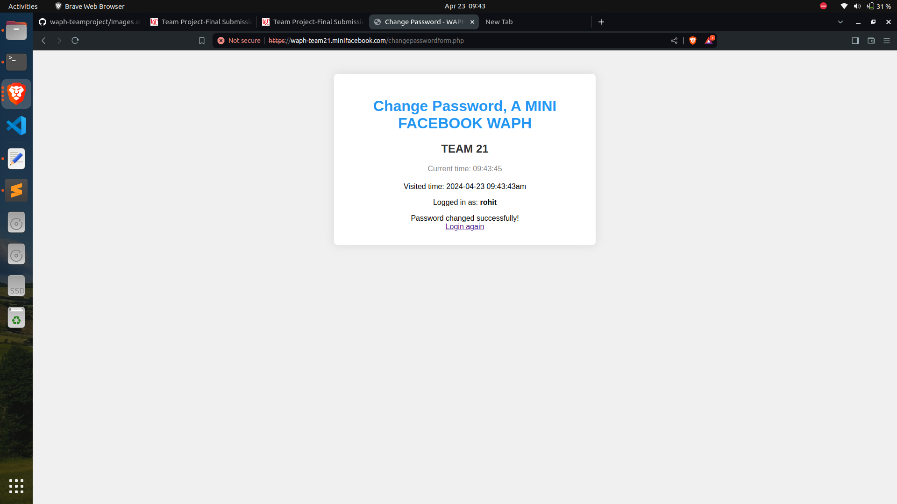

-Add a new post:
 
 
 
- Edit their own posts:
   
  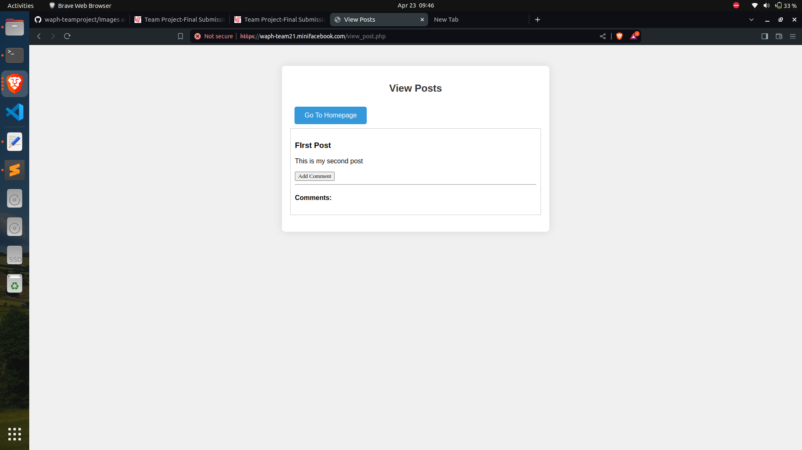

- Delete their own posts:
 

-Add comments on any post, e.g, by their own or others:
  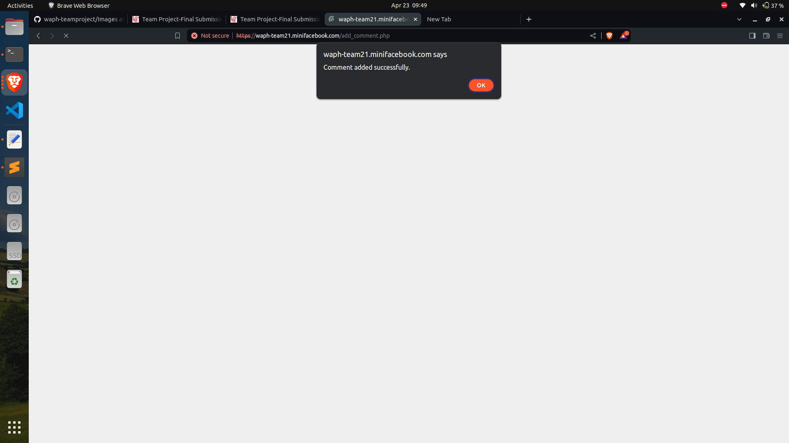
  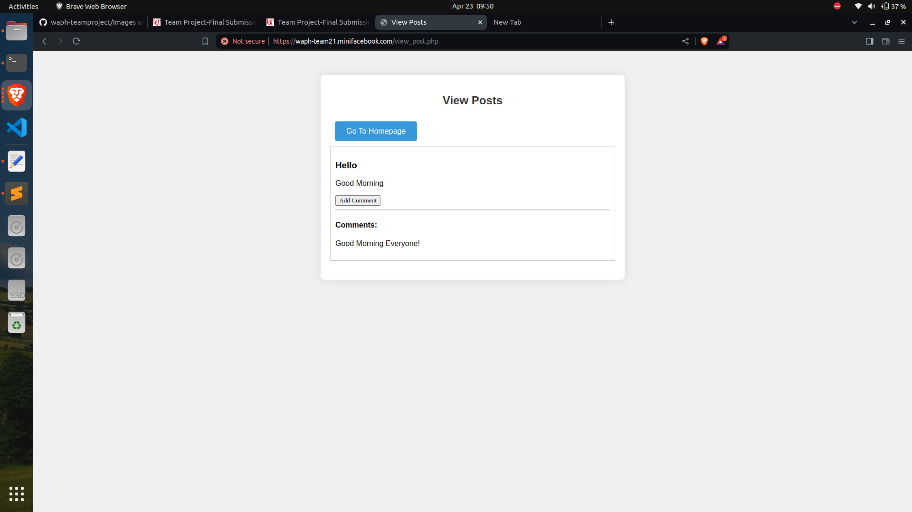

-Can have real-time chat with others*:
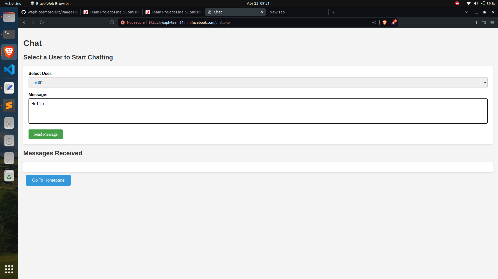
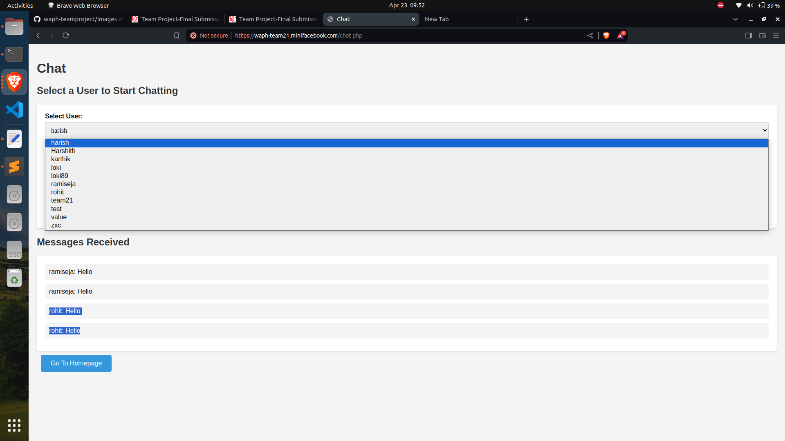

- Superusers can:
- Login (with the account added directly in the database):
  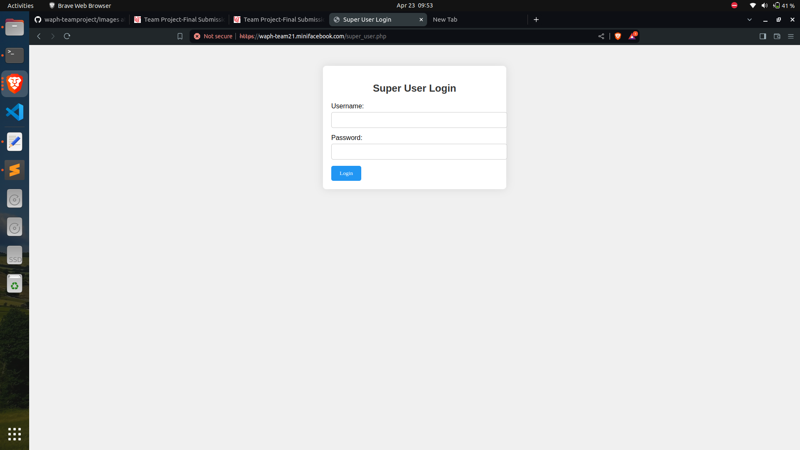
  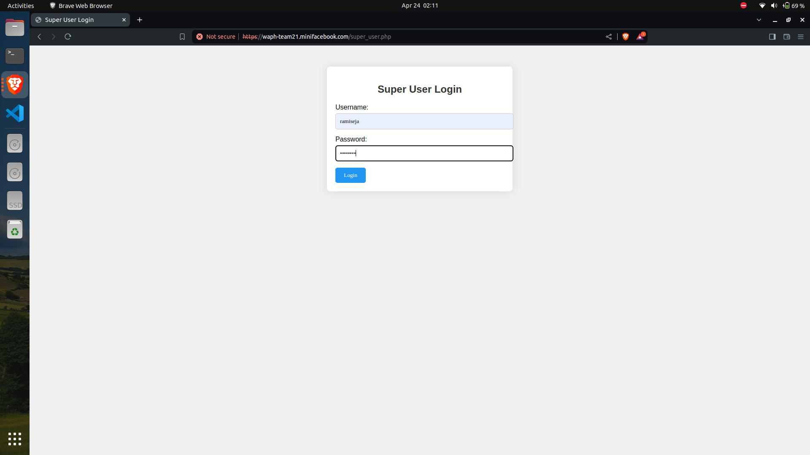
  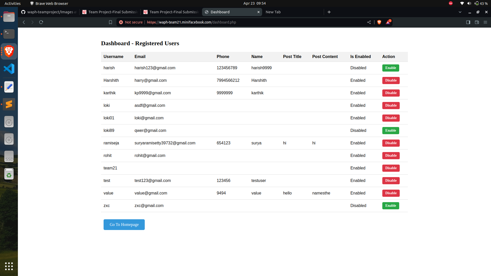

-View the list of registered users.:


-Disable (not delete) a registered user*:
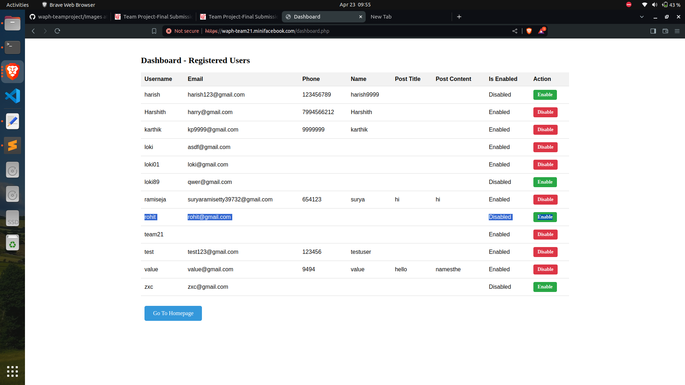


-Enable a registered user*:


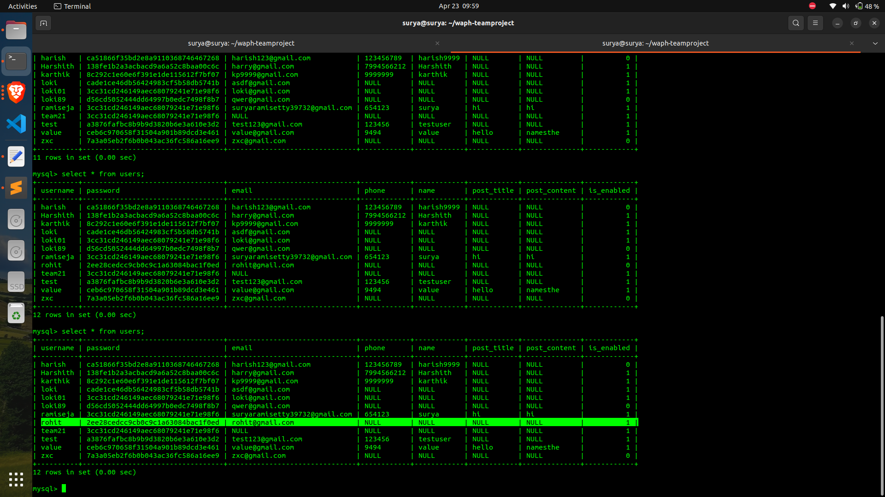
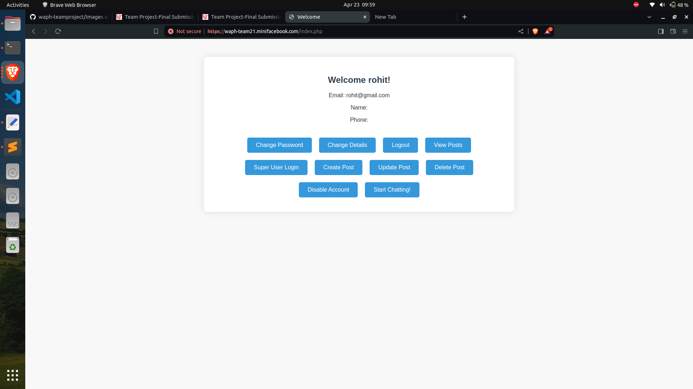

# Security and Non-Functional Requirements: 

- the system must be deployed on HTTPS:

  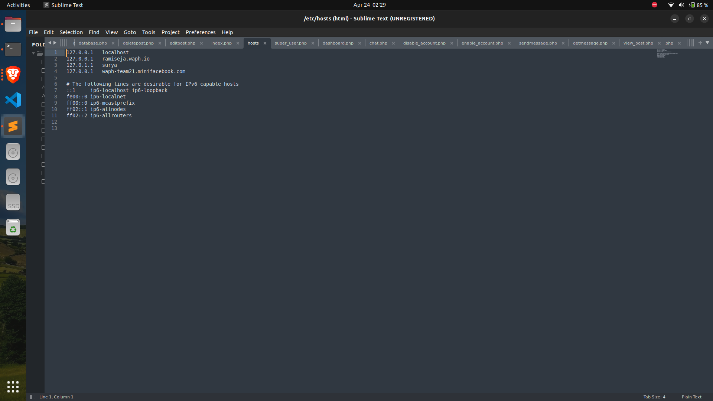


-Passwords must be hashed in the database and no MySQL root account used for the PHP code:

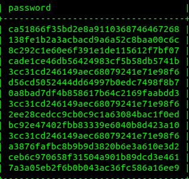

- All SQL must be in Prepared Statements:

- Data entered by the user can be separated from the SQL query itself using prepared statements. This is essential for stopping SQL injection attacks, which happen when erroneous SQL code is added to application queries, giving the attacker access to see or change database information.

- ```sql
  
  $prepared_sql = "INSERT INTO posts (content, author) VALUES (?, ?)"; 
  $stmt = $mysqli->prepare($prepared_sql);
  $stmt->bind_param('ss', $content, $author);
  ```
- HTML outputs must be sanitized:

  ``` sql
  if (isset($_POST["username"]) and isset($_POST["password"])) {

      if (checklogin_mysql($_POST["username"],$_POST["password"])) {

        $_SESSION['authenticated'] = TRUE;
        $_SESSION['username']= $_POST["username"];
    //$sanitized_username = htmlspecialchars($_POST['username'])
      }else{
        session_destroy();
        echo "<script>alert('Invalid username/password');window.location='form.php';</script>";
        die();
  }
  }
  if (!isset($_SESSION['authenticated']) or $_SESSION['authenticated']!= TRUE){
   session_destroy();
   echo "<script>alert('you have not login.please login')</script>";
   header("Refresh: 0; url=form.php");
   die();
  }
  if (!isset($_SESSION['authenticated']) || $_SESSION['authenticated'] !== true) {
    echo "<script>alert('Not authorized. Please login first.'); window.location='form.php';</script>";
    exit;
  }
   ```

- Role-based access control for registered users and super users:

Management of sessions:

Calling session_start() at the beginning of the code opens a PHP session.
This enables user-related data to be stored and retrieved by the programme across many pages.


Method of authentication:

The code determines whether the request method—which denotes a form submission—is POST.
From the POST data, it obtains the password and username that were submitted.
The given credentials are compared to hardcoded super user credentials.

Assigning roles:

The code stores the username and sets session variables to indicate successful authentication if the given credentials match those of the super user:

'authenticated' in $_SESSION['] = true;
$username = $_SESSION['username'];


Control of access:

After the login process is completed, the code takes the user to dashboard.php.
To restrict access to only authorised super users, the dashboard page can verify the session variables ($_SESSION['authenticated'] and $_SESSION['username']).


Error management

An error message is saved in the $loginError variable and shown on the login page if the credentials submitted are invalid.


Results:

An HTML form for super user login is generated by the code.
If there is an error message, it is displayed within the form.
The form sends the credentials it receives (super_user.php) to the same file for authentication.
Password hashing: Before being stored in a database, passwords should be salted and hashed to reduce security risks.
Validating user inputs (password and username) is important to guard against security flaws like SQL injection and cross-site scripting attacks.
Session management: Additional security mechanisms, such regenerating session IDs following authentication and setting the proper session cookie flags (like HttpOnly, Secure), should be incorporated into session management.
Database integration: For greater scalability and maintainability, super user credentials should be retrieved from a database rather than being hardcoded.

- A regular user cannot log in as a superuser:

  A regular user cannot logged in as a superuser because the credentials does not match wth database of the super user login where they cannot edit or post or not even logged in..
  

- Session Authentication and Hijacking Prevention

  Using session_start(), the code opens a PHP session.
  The $_SESSION['authenticated'] variable is checked to see if it is set to true.
  The code uses header("Refresh: 0; url=form.php") to reroute the user to the form.php page for login if they are not authenticated.
  The code sets the $_SESSION['authenticated'] and $_SESSION['username'] variables with the appropriate values following successful authentication.

-  CSRF Protection
For critical tasks, CSRF (Cross-Site Request Forgery) protection is usually applied by creating and validating a token.

A distinct CSRF token is created at the start of the PHP script and saved in the user's session:
```php
<?php
session_start();

// Generate a CSRF token if it doesn't exist
if (!isset($_SESSION['csrf_token'])) {
    $_SESSION['csrf_token'] = bin2hex(random_bytes(32));
}
```
Adding a hidden input box containing the CSRF token to forms that carry out sensitive activities (such as updating user information or changing passwords)
```html
<form action="update_password.php" method="post">
    <input type="hidden" name="csrf_token" value="<?php echo $_SESSION['csrf_token']; ?>">
    <!-- Form fields -->
    <input type="submit" value="Update Password">
</form>
```
CSRF token was verified on the server side: The PHP script that manages form submission verified the incoming CSRF token against the session's storage.

- Integrating an open-source front-end CSS template
HTML Structure: The HTML structure consists of a basic layout with placeholders for action buttons and user data that are dynamic content.
CSS Styles: These styles specify how elements like as buttons, paragraphs, headers, bodies, and containers look. Additionally, responsive styles (@media query) are included for smaller displays.
PHP Programme:
controls authentication and user sessions (session_start()).
Verifies whether the user is authenticated and logged in.
uses the getUserProfile function to retrieve user data from the database.
contains the checklogin_mysql function, which verifies user credentials against a MySQL database.
prevents session hijacking,
Integration with Database: To retrieve user data and verify credentials, the PHP code communicates with the waph_team21 MySQL database.
To stop SQL injection, it makes advantage of prepared statements ($stmt->bind_param).

The code contains the information about the database connection (localhost, team21, Pa$$w0rd,waph_team21).

-A team project website
[A team project website](https://waph-team21.github.io/)
(https://waph-team21.minifacebook.com)


- Video Demonstration:

  [finalprojectvideo.webm](https://github.com/waph-team21/waph-team21.github.io/assets/148410492/a48ebc0a-fbee-4bae-ad89-c5dfa9a9b4df)


# Appendix
Source code repository (private access): (https://github.com/waph-team21/waph-teamproject.git)

Project homepage (public): (https://github.com/waph-team21/waph-team21.github.io.git)

Team website- 
(https://waph-team21.minifacebook.com)

Code for  form.php:
```php
<!DOCTYPE html>
<html lang="en">
<head>
  <meta charset="utf-8">
  <title>WAPH-Login page</title>
  <style>
    body {
      font-family: 'Roboto', sans-serif;
      background-color: #f0f0f0;
      margin: 0;
      padding: 0;
    }
    .container {
      max-width: 500px;
      margin: 50px auto;
      padding: 30px;
      background-color: #ffffff;
      border-radius: 8px;
      box-shadow: 0 0 20px rgba(0, 0, 0, 0.1);
      text-align: center;
    }
    h1 {
      color: #2196f3;
    }
    h2 {
      color: #333;
      margin-bottom: 20px;
    }
    #digit-clock {
      font-size: 16px;
      color: #888;
      margin-bottom: 20px;
    }
    .form {
      margin-top: 20px;
    }
    .text_field {
      width: calc(100% - 24px);
      padding: 12px;
      margin-top: 10px;
      border: 1px solid #ccc;
      border-radius: 25px;
      box-shadow: none;
      transition: border-color 0.3s ease;
    }
    .text_field:focus {
      border-color: #2196f3;
    }
    .button {
      display: inline-block;
      padding: 15px 30px;
      margin-top: 20px;
      background-color: #2196f3;
      color: white;
      border: none;
      border-radius: 25px;
      cursor: pointer;
      transition: background-color 0.3s ease, transform 0.2s ease;
    }
    .button:hover {
      background-color: #0c7cd5;
      transform: translateY(-3px);
    }
  </style>
  <script type="text/javascript">
    function displayTime() {
      document.getElementById('digit-clock').innerHTML = "Current time: " + new Date().toLocaleTimeString();
    }
    setInterval(displayTime, 500);
  </script>
</head>
<body>
  <div class="container">
    <h1>A MINIFACEBOOK</h1>
    <h2>BY TEAM21</h2>
    <div id="digit-clock"></div>
<?php
      echo "Visited time: " . date("Y-m-d h:i:sa");
?>
    <form action="index.php" method="POST" class="form login">
      <input type="text" class="text_field" name="username" placeholder="Username" required><br>
      <input type="password" class="text_field" name="password" placeholder="Password" required><br>
      <a href="registrationform.php" class="button">Register Here</a>
      <button type="submit" class="button">Login Here</button>
      <a href="enable_account.php" class="button">Enable Account</a>
    </form>
  </div>
</body>
</html>
```


Code for index.php:
```php
<!DOCTYPE html>
<html lang="en">
<head>
  <meta charset="utf-8">
  <title>Welcome</title>
  <style>
body {
  font-family: 'Segoe UI', Tahoma, Geneva, Verdana, sans-serif;
  background-color: #f8f8f8;
  margin: 0;
  padding: 0;
  color: #333;
}

.container {
  max-width: 800px;
  margin: 50px auto;
  padding: 30px;
  background-color: #fff;
  border-radius: 10px;
  box-shadow: 0 0 20px rgba(0, 0, 0, 0.1);
  text-align: center;
}

h2 {
  color: #2c3e50;
  margin-bottom: 20px;
}

p {
  margin-bottom: 10px;
}

.button-container {
  display: flex;
  flex-wrap: wrap;
  justify-content: center;
  margin-top: 30px;
}

.button {
  display: inline-block;
  padding: 12px 24px;
  margin: 10px;
  background-color: #3498db;
  color: #fff;
  border: none;
  border-radius: 5px;
  cursor: pointer;
  transition: background-color 0.3s ease, transform 0.2s ease;
  text-decoration: none;
  font-size: 16px;
}

.button:hover {
  background-color: #2980b9;
  transform: translateY(-2px);
}

@media (max-width: 600px) {
  .button-container {
    flex-direction: column;
    align-items: center;
  }

  .button {
    margin: 10px 0;
  }
}

  </style>
</head>
<body>
<?php
    //session_set_cookie_params(15*60,"/","waph-team21.minifacebook.com",TRUE,TRUE);
  session_start(); 
  if (isset($_POST["username"]) and isset($_POST["password"])) {

      if (checklogin_mysql($_POST["username"],$_POST["password"])) {

        $_SESSION['authenticated'] = TRUE;
        $_SESSION['username']= $_POST["username"];
    //$sanitized_username = htmlspecialchars($_POST['username'])
      }else{
        session_destroy();
        echo "<script>alert('Invalid username/password');window.location='form.php';</script>";
        die();
  }
}
  if (!isset($_SESSION['authenticated']) or $_SESSION['authenticated']!= TRUE){
   session_destroy();
   echo "<script>alert('you have not login.please login')</script>";
   header("Refresh: 0; url=form.php");
   die();
  }
  if (!isset($_SESSION['authenticated']) || $_SESSION['authenticated'] !== true) {
    echo "<script>alert('Not authorized. Please login first.'); window.location='form.php';</script>";
    exit;
}

$userProfile = getUserProfile($_SESSION['username']);

function getUserProfile($username) {
    $mysqli = new mysqli('localhost', 'team21', 'Pa$$w0rd', 'waph_team21');
    if ($mysqli->connect_errno) {
        echo "Database connection failed: " . $mysqli->connect_error;
        exit();
    }

    $sql = "SELECT * FROM users WHERE username=?";
    $stmt = $mysqli->prepare($sql);
    $stmt->bind_param("s", $username);
    $stmt->execute();
    $result = $stmt->get_result();
    return $result->fetch_assoc();
}
  /*if($_SESSION['browser'] != $_SERVER['HTTP_USER_AGENT']){
    session_destroy();
    echo "<script>alert('session hijacking attack is detected!');</script>";
    header("Refresh:0; url=form.php");
    die();
  }

  /*function checklogin($username, $password) {
    $account = array("admin","1234");
    if (($username== $account[0]) and ($password == $account[1])) 
      return TRUE;
    else 
      return FALSE;
    }*/

    function checklogin_mysql($username, $password) {
    $mysqli = new mysqli('localhost', 'team21', 'Pa$$w0rd', 'waph_team21');
    if ($mysqli->connect_errno) {
        printf("Database connection failed : %s\n", $mysqli->connect_error);
        exit();
    }

    $sql = "SELECT * FROM users WHERE username = ? AND password = md5(?) AND is_enabled = 1";
    $stmt = $mysqli->prepare($sql);
    $stmt->bind_param("ss", $username, $password);
    $stmt->execute();
    $result = $stmt->get_result();
    if ($result->num_rows == 1) {
        return true;
    }
    return false;
}

?>
  <div class="container">
    <h2>Welcome <?php echo htmlentities($_SESSION['username']); ?>!</h2>
    <p>Email: <?php echo htmlentities($userProfile['email']); ?></p>
    <p>Name: <?php echo htmlentities($userProfile['name']); ?></p>
    <p>Phone: <?php echo htmlentities($userProfile['phone']); ?></p>

    <div class="button-container">
      <a class="button" href="changepasswordform.php">Change Password</a>
      <a class="button" href="updatedetails.php">Change Details</a>
      <a class="button" href="logout.php">Logout</a>
      <a class="button" href="view_post.php">View Posts</a>
      <a class="button" href="super_user.php">Super User Login</a>
      <a class="button" href="create_post.php">Create Post</a>
      <a class="button" href="update_post.php">Update Post</a>
      <a class="button" href="delete_post.php">Delete Post</a>
      <a class="button" href="disable_account.php">Disable Account</a>
      <a class="button" href="chat.php">Start Chatting!</a>
      
    </div>
  </div>
</body>
</html>
```

Code for index.html:
```php
<!DOCTYPE html>
<html lang="en">
<head>
  <meta charset="utf-8">
  <title>Welcome</title>
  <style>
body {
  font-family: 'Segoe UI', Tahoma, Geneva, Verdana, sans-serif;
  background-color: #f8f8f8;
  margin: 0;
  padding: 0;
  color: #333;
}

.container {
  max-width: 800px;
  margin: 50px auto;
  padding: 30px;
  background-color: #fff;
  border-radius: 10px;
  box-shadow: 0 0 20px rgba(0, 0, 0, 0.1);
  text-align: center;
}

h2 {
  color: #2c3e50;
  margin-bottom: 20px;
}

p {
  margin-bottom: 10px;
}

.button-container {
  display: flex;
  flex-wrap: wrap;
  justify-content: center;
  margin-top: 30px;
}

.button {
  display: inline-block;
  padding: 12px 24px;
  margin: 10px;
  background-color: #3498db;
  color: #fff;
  border: none;
  border-radius: 5px;
  cursor: pointer;
  transition: background-color 0.3s ease, transform 0.2s ease;
  text-decoration: none;
  font-size: 16px;
}

.button:hover {
  background-color: #2980b9;
  transform: translateY(-2px);
}

@media (max-width: 600px) {
  .button-container {
    flex-direction: column;
    align-items: center;
  }

  .button {
    margin: 10px 0;
  }
}

  </style>
</head>
<body>
<?php
    //session_set_cookie_params(15*60,"/","waph-team21.minifacebook.com",TRUE,TRUE);
  session_start(); 
  if (isset($_POST["username"]) and isset($_POST["password"])) {

      if (checklogin_mysql($_POST["username"],$_POST["password"])) {

        $_SESSION['authenticated'] = TRUE;
        $_SESSION['username']= $_POST["username"];
    //$sanitized_username = htmlspecialchars($_POST['username'])
      }else{
        session_destroy();
        echo "<script>alert('Invalid username/password');window.location='form.php';</script>";
        die();
  }
}
  if (!isset($_SESSION['authenticated']) or $_SESSION['authenticated']!= TRUE){
   session_destroy();
   echo "<script>alert('you have not login.please login')</script>";
   header("Refresh: 0; url=form.php");
   die();
  }
  if (!isset($_SESSION['authenticated']) || $_SESSION['authenticated'] !== true) {
    echo "<script>alert('Not authorized. Please login first.'); window.location='form.php';</script>";
    exit;
}

$userProfile = getUserProfile($_SESSION['username']);

function getUserProfile($username) {
    $mysqli = new mysqli('localhost', 'team21', 'Pa$$w0rd', 'waph_team21');
    if ($mysqli->connect_errno) {
        echo "Database connection failed: " . $mysqli->connect_error;
        exit();
    }

    $sql = "SELECT * FROM users WHERE username=?";
    $stmt = $mysqli->prepare($sql);
    $stmt->bind_param("s", $username);
    $stmt->execute();
    $result = $stmt->get_result();
    return $result->fetch_assoc();
}
  if($_SESSION['browser'] != $_SERVER['HTTP_USER_AGENT']){
    session_destroy();
    echo "<script>alert('session hijacking attack is detected!');</script>";
    header("Refresh:0; url=form.php");
    die();
  }

  /*function checklogin($username, $password) {
    $account = array("admin","1234");
    if (($username== $account[0]) and ($password == $account[1])) 
      return TRUE;
    else 
      return FALSE;
    }*/

    function checklogin_mysql($username, $password) {
    $mysqli = new mysqli('localhost', 'team21', 'Pa$$w0rd', 'waph_team21');
    if ($mysqli->connect_errno) {
        printf("Database connection failed : %s\n", $mysqli->connect_error);
        exit();
    }

    $sql = "SELECT * FROM users WHERE username = ? AND password = md5(?) AND is_enabled = 1";
    $stmt = $mysqli->prepare($sql);
    $stmt->bind_param("ss", $username, $password);
    $stmt->execute();
    $result = $stmt->get_result();
    if ($result->num_rows == 1) {
        return true;
    }
    return false;
}

?>
  <div class="container">
    <h2>Welcome <?php echo htmlentities($_SESSION['username']); ?>!</h2>
    <p>Email: <?php echo htmlentities($userProfile['email']); ?></p>
    <p>Name: <?php echo htmlentities($userProfile['name']); ?></p>
    <p>Phone: <?php echo htmlentities($userProfile['phone']); ?></p>

    <div class="button-container">
      <a class="button" href="changepasswordform.php">Change Password</a>
      <a class="button" href="updatedetails.php">Change Details</a>
      <a class="button" href="logout.php">Logout</a>
      <a class="button" href="view_post.php">View Posts</a>
      <a class="button" href="super_user.php">Super User Login</a>
      <a class="button" href="create_post.php">Create Post</a>
      <a class="button" href="update_post.php">Update Post</a>
      <a class="button" href="delete_post.php">Delete Post</a>
      <a class="button" href="disable_account.php">Disable Account</a>
      <a class="button" href="chat.php">Start Chatting!</a>
      
    </div>
  </div>
</body>
</html>
```
Code for logout.php:
``` php
<!DOCTYPE html>
<html lang="en">
<head>
  <meta charset="UTF-8">
  <title>Logout</title>
  <style>
    body {
      font-family: 'Segoe UI', Tahoma, Geneva, Verdana, sans-serif;
      background-color: #e6f7ff;
      margin: 0;
      display: flex;
      justify-content: center;
      align-items: center;
      min-height: 100vh;
      text-align: center;
    }
    h2 {
      color: #0056b3;
      margin-bottom: 20px;
    }
    a {
      display: inline-block;
      padding: 15px 30px;
      background-color: #007bff;
      color: white;
      text-decoration: none;
      border-radius: 25px;
      transition: background-color 0.3s, transform 0.2s;
    }
    a:hover {
      background-color: #0056b3;
      transform: translateY(-3px);
    }
  </style>
</head>
<body>
  <h2>Wanna login again??</h2>
  <a href="form.php">  CLICK HERE 
  </a>
</body>
</html>
```
Code for getmessage.php:
```php
<?php
// Fetch recent chat messages from the database
$mysqli = new mysqli('localhost', 'team21', 'password', 'database_name');
if ($mysqli->connect_errno) {
    echo "Database connection failed: " . $mysqli->connect_error;
    exit;
}

$sql = "SELECT * FROM chat_messages ORDER BY created_at DESC LIMIT 50";
$result = $mysqli->query($sql);

$messages = [];
while ($row = $result->fetch_assoc()) {
    $messages[] = $row;
}

echo json_encode($messages);
$mysqli->close();
```
Code for registrationform.php:
```php
<!DOCTYPE html>
<html lang="en">
<head>
  <meta charset="utf-8">
  <title>WAPH-Registration page</title>
  <style>
    body {
      font-family: 'Roboto', sans-serif;
      background-color: #f0f0f0;
      margin: 0;
      padding: 0;
    }
    .container {
      max-width: 500px;
      margin: 50px auto;
      padding: 30px;
      background-color: #ffffff;
      border-radius: 8px;
      box-shadow: 0 0 20px rgba(0, 0, 0, 0.1);
      text-align: center;
    }
    h1 {
      color: #2196f3;
    }
    h2 {
      color: #333;
      margin-bottom: 20px;
    }
    #digit-clock {
      font-size: 16px;
      color: #888;
      margin-bottom: 20px;
    }
    .form {
      margin-top: 20px;
    }
    .text_field {
      width: calc(100% - 24px);
      padding: 12px;
      margin-top: 10px;
      border: 1px solid #ccc;
      border-radius: 25px;
      box-shadow: none;
      transition: border-color 0.3s ease;
    }
    .text_field:focus {
      border-color: #2196f3;
    }
    .button {
      display: inline-block;
      padding: 15px 30px;
      margin-top: 20px;
      background-color: #2196f3;
      color: white;
      border: none;
      border-radius: 25px;
      cursor: pointer;
      transition: background-color 0.3s ease, transform 0.2s ease;
    }
    .button:hover {
      background-color: #0c7cd5;
      transform: translateY(-3px);
    }
  </style>
  <script type="text/javascript">
    function displayTime() {
      document.getElementById('digit-clock').innerHTML = "Current time: " + new Date().toLocaleTimeString();
    }
    setInterval(displayTime, 500);
  </script>
</head>
<body>
  <div class="container">
    <h1>New User Registration, WAPH</h1>
    <h2>A MINI FACEBOOK-TEAM21</h2>
    <div id="digit-clock"></div>
    <form action="addnewuser.php" method="POST" name="registerForm" onsubmit="return validateForm()">
      <div class="form-group">
        <label for="username">Username:</label>
        <input type="text" id="username" name="username" class="text_field" required placeholder="Username">
      </div>
      <div class="form-group">
        <label for="password">Password:</label>
        <input type="password" id="password" name="password" class="text_field" required
               pattern="^(?=.*[a-z])(?=.*[A-Z])(?=.*[0-9])(?=.*[!@#$%^&])[\w!@#$%^&]{8,}$"
               placeholder="Your password"
               title="Password must have at least 8 characters with 1 special symbol !@#$%^& 1 number, 1 lowercase, and 1 UPPERCASE."
               onchange="this.setCustomValidity(this.validity.patternMismatch ? this.title : ''); form.repassword.pattern = this.value;">
      </div>
      <div class="form-group">
        <label for="repassword">Retype Password:</label>
        <input type="password" id="repassword" name="repassword" class="text_field" required
                        placeholder="Retype your password"
                        title="Password does not match."
                        onchange="this.setCustomValidity(this.validity.patternMismatch ? this.title : '');">
      </div>
      <div class="form-group">
        <label for="email">Email:</label>
        <input type="email" id="email" name="email" class="text_field" required placeholder="Your Email">
      </div>
      <input type="submit" value="Register" class="button">
    </form>
  </div>

  <script type="text/javascript">
    function validateForm() {
      var password = document.forms["registerForm"]["password"].value;
      var repassword = document.forms["registerForm"]["repassword"].value;

      if (password !== repassword) {
        alert("Passwords do not match.");
        return false;
      }
      return true;
    }
  </script>
</body>
</html>
```
Code for sendmessage.php:
```php
<?php
session_start();

if ($_SERVER['REQUEST_METHOD'] === 'POST' && isset($_SESSION['username'])) {
    $username = $_SESSION['username'];
    $message = $_POST['message'];

    // Insert the message into the database
    $mysqli = new mysqli('localhost', 'team21', 'password', 'waph_team21');
    if ($mysqli->connect_errno) {
        echo "Database connection failed: " . $mysqli->connect_error;
        exit;
    }

    $sql = "INSERT INTO chat_messages (username, message) VALUES (?, ?)";
    $stmt = $mysqli->prepare($sql);
    $stmt->bind_param("ss", $username, $message);
    $stmt->execute();
    $stmt->close();
    $mysqli->close();
}
?>
```
Code for session_auth.php:
```php
<?php
// Start the session
session_set_cookie_params(15*60,"/","ramiseja.waph.io",TRUE,TRUE);
session_start();

// Check authentication status
if(!isset($_SESSION["authenticated"]) || $_SESSION["authenticated"] !== TRUE) {
    // Not authenticated, destroy session and redirect
    session_destroy();
    echo "<script>alert('You have not logged in. Please login first!');</script>";
    header("Refresh: 0; url=form.php");
    die();
}

// Check for session hijacking
if(isset($_SESSION["browser"]) && isset($_SERVER["HTTP_USER_AGENT"]) && $_SESSION["browser"] !== $_SERVER["HTTP_USER_AGENT"]) {
    echo "<script>alert('Session hijacking is detected!');</script>";
    header("Refresh: 0; url=form.php");
    die();
}
?>
```
Code for super_user.php:
```php
<?php
session_start();

// Check if the form is submitted
if ($_SERVER["REQUEST_METHOD"] == "POST") {
    $username = $_POST["username"];
    $password = $_POST["password"];

    // Check if the submitted username and password match the super user credentials
    if ($username === "ramiseja" && $password === "Thor@123") {
        // Set session variables to indicate authentication
        $_SESSION['authenticated'] = true;
        $_SESSION['username'] = $username;

        // Redirect to a page after successful login (e.g., dashboard.php)
        header("Location: dashboard.php");
        exit;
    } else {
        $loginError = "Invalid username or password. Please try again.";
    }
}
?>

<!DOCTYPE html>
<html>
<head>
    <title>Super User Login</title>
    <style>
        /* Your CSS styles here */
        body {
            font-family: Arial, sans-serif;
            background-color: #f0f0f0;
            margin: 0;
            padding: 0;
        }

        .container {
            max-width: 400px;
            margin: 50px auto;
            padding: 20px;
            background-color: #fff;
            border-radius: 8px;
            box-shadow: 0 0 20px rgba(0, 0, 0, 0.1);
        }

        h2 {
            color: #333;
            text-align: center;
            margin-bottom: 20px;
        }

        form {
            margin-top: 20px;
        }

        label {
            display: block;
            margin-bottom: 5px;
        }

        input[type="text"],
        input[type="password"] {
            width: 100%;
            padding: 10px;
            margin-bottom: 15px;
            border: 1px solid #ccc;
            border-radius: 5px;
        }

        input[type="submit"] {
            padding: 10px 20px;
            background-color: #2196f3;
            color: #fff;
            border: none;
            border-radius: 5px;
            cursor: pointer;
            transition: background-color 0.3s ease;
        }

        input[type="submit"]:hover {
            background-color: #0c7cd5;
        }

        .error {
            color: red;
            margin-bottom: 10px;
        }
    </style>
</head>
<body>
    <div class="container">
        <h2>Super User Login</h2>
        <?php if (isset($loginError)) : ?>
            <div class="error"><?php echo $loginError; ?></div>
        <?php endif; ?>
        <form action="<?php echo htmlspecialchars($_SERVER["PHP_SELF"]); ?>" method="POST">
            <label for="username">Username:</label>
            <input type="text" id="username" name="username" required>

            <label for="password">Password:</label>
            <input type="password" id="password" name="password" required>

            <input type="submit" value="Login">
        </form>
    </div>
</body>
</html>
```
Code for update_post.php:
```php
<?php
session_start();

if (!isset($_SESSION['authenticated']) || $_SESSION['authenticated'] !== true) {
    echo "<script>alert('Not authorized. Please login first.'); window.location='form.php';</script>";
    exit;
}

$userId = $_SESSION["username"];

// Fetch the user's posts from the database
$userPosts = getUserPosts($userId);

if ($_SERVER["REQUEST_METHOD"] == "POST") {
    $postId = $_POST["post_id"];
    $newContent = $_POST["new_content"];

    if (updatePost($postId, $newContent)) {
        echo "<script>alert('Post updated successfully.');</script>";
    } else {
        echo "<script>alert('Failed to update post. Try again!');</script>";
    }
}

function getUserPosts($userId) {
    $mysqli = new mysqli('localhost', 'team21', 'Pa$$w0rd', 'waph_team21');
    if ($mysqli->connect_errno) {
        echo "Database connection failed: " . $mysqli->connect_error;
        exit;
    }

    $sql = "SELECT id, title FROM posts WHERE user_id = ?";
    $stmt = $mysqli->prepare($sql);
    $stmt->bind_param("s", $userId);
    $stmt->execute();
    $result = $stmt->get_result();
    $posts = [];
    while ($row = $result->fetch_assoc()) {
        $posts[$row['id']] = $row['title'];
    }
    $stmt->close();
    $mysqli->close();
    return $posts;
}

function updatePost($postId, $newContent) {
    $mysqli = new mysqli('localhost', 'team21', 'Pa$$w0rd', 'waph_team21');
    if ($mysqli->connect_errno) {
        echo "Database connection failed: " . $mysqli->connect_error;
        return false;
    }

    $sql = "UPDATE posts SET content = ? WHERE id = ?";
    $stmt = $mysqli->prepare($sql);
    $stmt->bind_param("si", $newContent, $postId);

    if ($stmt->execute()) {
        $stmt->close();
        $mysqli->close();
        return true;
    } else {
        $stmt->close();
        $mysqli->close();
        return false;
    }
}
?>
<!DOCTYPE html>
<html>
<head>
    <title>Update Post</title>
    <style>
        /* Your CSS styles here */
            body {
            font-family: Arial, sans-serif;
            background-color: #f0f0f0;
            margin: 0;
            padding: 0;
        }

        .container {
            max-width: 600px;
            margin: 50px auto;
            padding: 20px;
            background-color: #fff;
            border-radius: 8px;
            box-shadow: 0 0 20px rgba(0, 0, 0, 0.1);
        }

        h2 {
            color: #333;
            text-align: center;
            margin-bottom: 20px;
        }

        form {
            margin-top: 20px;
        }

        label {
            display: block;
            margin-bottom: 5px;
        }

        input[type="text"],
        textarea {
            width: 100%;
            padding: 10px;
            margin-bottom: 15px;
            border: 1px solid #ccc;
            border-radius: 5px;
        }

        input[type="submit"],
        button[type="button"] {
            padding: 10px 20px;
            background-color: #2196f3;
            color: #fff;
            border: none;
            border-radius: 5px;
            cursor: pointer;
            transition: background-color 0.3s ease;
        }

        input[type="submit"]:hover,
        button[type="button"]:hover {
            background-color: #0c7cd5;
        }
    </style>
</head>
<body>
    <div class="container">
        <h2>Update Post</h2>
        <form action="update_post.php" method="POST">
            <label for="post_id">Select Post:</label>
            <select id="post_id" name="post_id" required>
                <?php foreach ($userPosts as $id => $title) : ?>
                    <option value="<?php echo $id; ?>"><?php echo $title; ?></option>
                <?php endforeach; ?>
            </select>

            <label for="new_content">New Content:</label>
            <textarea id="new_content" name="new_content" required></textarea>

            <input type="submit" value="Update Post">
            <button type="button" onclick="window.location.href='index.php'">Back to Home</button>
        </form>
    </div>
</body>
</html>
```
Code for updatedetails.php:
```php

<?php
session_set_cookie_params(15*60, "/", "waph-team21.minifacebook.com", true, true);
session_start();

if (!isset($_SESSION["authenticated"]) || $_SESSION["authenticated"] !== true) {
    echo "<script>alert('Not authorized. Please login first.'); window.location='form.php';</script>";
    exit;
}

$userProfile = getUserProfile($_SESSION['username']);

if ($_SERVER["REQUEST_METHOD"] == "POST") {
    $newUsername = $_POST["new_username"];
    $newEmail = $_POST["new_email"];
    $newName = $_POST["new_name"];
    $newPhone = $_POST["new_phone"];

    if (updateUserDetails($_SESSION['username'], $newUsername, $newEmail, $newName, $newPhone)) {
        $_SESSION['username'] = $newUsername;
        $userProfile = getUserProfile($_SESSION['username']);
        echo "<script>alert('User details updated successfully. Check the updates.');</script>";
    } else {
        echo "<script>alert('Failed to update user details. Try again!');</script>";
    }
}

function getUserProfile($username) {
    $mysqli = new mysqli('localhost', 'team21', 'Pa$$w0rd', 'waph_team21');
    if ($mysqli->connect_errno) {
        echo "Database connection failed: " . $mysqli->connect_error;
        exit();
    }

    $sql = "SELECT * FROM users WHERE username=?";
    $stmt = $mysqli->prepare($sql);
    $stmt->bind_param("s", $username);
    $stmt->execute();
    $result = $stmt->get_result();
    return $result->fetch_assoc();
}

function updateUserDetails($username, $newUsername, $newEmail, $newName, $newPhone) {
    $mysqli = new mysqli('localhost', 'team21', 'Pa$$w0rd', 'waph_team21');
    if ($mysqli->connect_errno) {
        echo "Database connection failed: " . $mysqli->connect_error;
        return false;
    }

    $sql = "UPDATE users SET username=?, email=?, name=?, phone=? WHERE username=?";
    $stmt = $mysqli->prepare($sql);
    $stmt->bind_param("sssss", $newUsername, $newEmail, $newName, $newPhone, $username);
    return $stmt->execute();
}
?>
<!DOCTYPE html>
<html lang="en">
<head>
  <meta charset="UTF-8">
  <title>Update Details</title>
  <style>
    body {
      font-family: 'Roboto', sans-serif;
      background-color: #f0f0f0;
      margin: 0;
      padding: 0;
    }
    .container {
      max-width: 500px;
      margin: 50px auto;
      padding: 30px;
      background-color: #ffffff;
      border-radius: 8px;
      box-shadow: 0 0 20px rgba(0, 0, 0, 0.1);
      text-align: center;
    }
    h1 {
      color: #2196f3;
    }
    h2 {
      color: #333;
      margin-bottom: 20px;
    }
    #digit-clock {
      font-size: 16px;
      color: #888;
      margin-bottom: 20px;
    }
    .form {
      margin-top: 20px;
    }
    .text_field {
      width: calc(100% - 24px);
      padding: 12px;
      margin-top: 10px;
      border: 1px solid #ccc;
      border-radius: 25px;
      box-shadow: none;
      transition: border-color 0.3s ease;
    }
    .text_field:focus {
      border-color: #2196f3;
    }
    .button {
      display: inline-block;
      padding: 15px 30px;
      margin-top: 20px;
      background-color: #2196f3;
      color: white;
      border: none;
      border-radius: 25px;
      cursor: pointer;
      transition: background-color 0.3s ease, transform 0.2s ease;
    }
    .button:hover {
      background-color: #0c7cd5;
      transform: translateY(-3px);
    }
  </style>
</head>
<body>
  <div class="container">
    <h1>Update Details</h1>
    <form action="updatedetails.php" method="POST">
      <div class="form-group">
        <label for="new_username">New Username:</label>
        <input type="text" id="new_username" name="new_username" class="text_field" value="<?php echo htmlentities($userProfile['username']); ?>" required>
      </div>
      <div class="form-group">
        <label for="new_email">New Email:</label>
        <input type="email" id="new_email" name="new_email" class="text_field" value="<?php echo htmlentities($userProfile['email']); ?>" required>
      </div>
      <div class="form-group">
        <label for="new_name">New Name:</label>
        <input type="text" id="new_name" name="new_name" class="text_field" value="<?php echo htmlentities($userProfile['name']); ?>" required>
      </div>
      <div class="form-group">
        <label for="new_phone">New Phone:</label>
        <input type="text" id="new_phone" name="new_phone" class="text_field" value="<?php echo htmlentities($userProfile['phone']); ?>" required>
      </div>
      <input type="submit" value="Update Details" class="button">
      <button type="button" class="button" onclick="window.location.href='form.php'">Back to Login Page</button>
    </form>
  </div>
</body>
</html>
```
Code for view_post.php:
```php
<?php
session_start();

if (!isset($_SESSION['authenticated']) || $_SESSION['authenticated'] !== true) {
    echo "<script>alert('Not authorized. Please login first.'); window.location='form.php';</script>";
    exit;
}

$userId = $_SESSION["username"];

// Fetch all posts made by the user
$userPosts = getUserPosts($userId);

function getUserPosts($userId) {
    $mysqli = new mysqli('localhost', 'team21', 'Pa$$w0rd', 'waph_team21');
    if ($mysqli->connect_errno) {
        echo "Database connection failed: " . $mysqli->connect_error;
        exit;
    }

    $sql = "SELECT * FROM posts WHERE user_id = ? ORDER BY created_at DESC";
    $stmt = $mysqli->prepare($sql);
    $stmt->bind_param("s", $userId);
    $stmt->execute();
    $result = $stmt->get_result();
    $posts = [];
    while ($row = $result->fetch_assoc()) {
        $posts[] = $row;
    }
    $stmt->close();
    $mysqli->close();
    return $posts;
}

function getPostComments($postId) {
    $mysqli = new mysqli('localhost', 'team21', 'Pa$$w0rd', 'waph_team21');
    if ($mysqli->connect_errno) {
        echo "Database connection failed: " . $mysqli->connect_error;
        exit;
    }

    $sql = "SELECT * FROM comments WHERE post_id = ?";
    $stmt = $mysqli->prepare($sql);
    $stmt->bind_param("i", $postId);
    $stmt->execute();
    $result = $stmt->get_result();
    $comments = [];
    while ($row = $result->fetch_assoc()) {
        $comments[] = $row;
    }
    $stmt->close();
    $mysqli->close();
    return $comments;
}
?>

<!DOCTYPE html>
<html>
<head>
    <title>View Posts</title>
    <style>
        /* Your CSS styles here */
        body {
            font-family: Arial, sans-serif;
            background-color: #f0f0f0;
            margin: 0;
            padding: 0;
        }

        .container {
            max-width: 600px;
            margin: 50px auto;
            padding: 20px;
            background-color: #fff;
            border-radius: 8px;
            box-shadow: 0 0 20px rgba(0, 0, 0, 0.1);
        }

        h2 {
            color: #333;
            text-align: center;
            margin-bottom: 20px;
        }

        form {
            margin-top: 20px;
        }

        label {
            display: block;
            margin-bottom: 5px;
        }

        input[type="text"],
        textarea {
            width: 100%;
            padding: 10px;
            margin-bottom: 15px;
            border: 1px solid #ccc;
            border-radius: 5px;
        }

        input[type="submit"],
        button[type="button"] {
            padding: 10px 20px;
            background-color: #2196f3;
            color: #fff;
            border: none;
            border-radius: 5px;
            cursor: pointer;
            transition: background-color 0.3s ease;
        }

        input[type="submit"]:hover,
        button[type="button"]:hover {
            background-color: #0c7cd5;
        }
        .post {
            border: 1px solid #ccc;
            padding: 10px;
            margin-bottom: 20px;
        }

        .comments {
            margin-top: 10px;
        }
        .button {
            display: inline-block;
            padding: 12px 24px;
            margin: 10px;
            background-color: #3498db;
            color: #fff;
            border: none;
            border-radius: 5px;
            cursor: pointer;
            transition: background-color 0.3s ease, transform 0.2s ease;
            text-decoration: none;
            font-size: 16px;
        }
    </style>
</head>
<body>
    <div class="container">
        <h2>View Posts</h2>
        <a class="button" href="index.php">Go To Homepage</a>

        <?php foreach ($userPosts as $post) : ?>
            <div class="post">
                <h3><?php echo htmlspecialchars($post['title']); ?></h3>
                <p><?php echo htmlspecialchars($post['content']); ?></p>
                <button onclick="showCommentForm(<?php echo $post['id']; ?>)">Add Comment</button>
                <div id="commentForm_<?php echo $post['id']; ?>" style="display: none;">
                    <form action="add_comment.php" method="POST">
                        <input type="hidden" name="post_id" value="<?php echo $post['id']; ?>">
                        <textarea name="comment_content" required></textarea>
                        <input type="submit" value="Submit Comment">
                    </form>
                </div>
                <hr>
                <div class="comments">
                    <h4>Comments:</h4>
                    <?php
                    // Fetch comments for this post
                    $comments = getPostComments($post['id']);
                    foreach ($comments as $comment) {
                        echo "<p>" . htmlspecialchars($comment['content']) . "</p>";
                    }
                    ?>
                </div>
            </div>
        <?php endforeach; ?>
    </div>

    <script>
        function goBack() {
            window.history.back();
        }

        function showCommentForm(postId) {
            var commentForm = document.getElementById("commentForm_" + postId);
            if (commentForm.style.display === "none") {
                commentForm.style.display = "block";
            } else {
                commentForm.style.display = "none";
            }
        }
    </script>
</body>
</html>
```
Code for ad_comment.php:
```php

<?php
session_start();

if (!isset($_SESSION['authenticated']) || $_SESSION['authenticated'] !== true) {
    echo "<script>alert('Not authorized. Please login first.'); window.location='form.php';</script>";
    exit;
}

if ($_SERVER["REQUEST_METHOD"] == "POST") {
    $postId = $_POST["post_id"];
    $commentContent = $_POST["comment_content"];

    // Validate comment content (e.g., check for empty content, length, etc.)
    if (empty($commentContent)) {
        echo "<script>alert('Comment content is required.'); window.history.back();</script>";
        exit;
    }

    // Add comment to the database
    if (addComment($postId, $_SESSION["username"], $commentContent)) {
        echo "<script>alert('Comment added successfully.'); window.location='view_post.php';</script>";
    } else {
        echo "<script>alert('Failed to add comment. Please try again.'); window.history.back();</script>";
    }
} else {
    echo "<script>alert('Invalid request.'); window.history.back();</script>";
}

function addComment($postId, $userId, $commentContent) {
    $mysqli = new mysqli('localhost', 'team21', 'Pa$$w0rd', 'waph_team21');
    if ($mysqli->connect_errno) {
        echo "Database connection failed: " . $mysqli->connect_error;
        return false;
    }

    $sql = "INSERT INTO comments (post_id, user_id, content) VALUES (?, ?, ?)";
    $stmt = $mysqli->prepare($sql);
    $stmt->bind_param("iss", $postId, $userId, $commentContent);

    if ($stmt->execute()) {
        $stmt->close();
        $mysqli->close();
        return true;
    } else {
        $stmt->close();
        $mysqli->close();
        return false;
    }
}
?>
```
Code for addcommment.php:
```php
<?php
session_start();

// Check if the user is logged in and if the session has not been hijacked
if (!isset($_SESSION["authenticated"]) || $_SESSION["authenticated"] !== true || $_SESSION["browser"] !== $_SERVER["HTTP_USER_AGENT"]) {
    header("Location: form.php");
    exit();
}

 $mysqli = new mysqli('localhost', 'team21', 'Pa$$w0rd', 'waph_team21');
if ($mysqli->connect_error) {
    die("Connection failed: " . $mysqli->connect_error);
}

// Check for valid POST request
if ($_SERVER["REQUEST_METHOD"] == "POST" && isset($_POST['comment']) && !empty($_POST['comment'])) {
    if (isset($_POST['post_ID']) && ctype_digit($_POST['post_ID'])) {
        $post_ID = $_POST['post_ID'];
        $comment = trim($_POST['comment']);
        $username = $_SESSION['username'];  // Username of the logged-in user
        $timestamp = date('Y-m-d H:i:s');   // Current timestamp

        // Prepare and bind
        $stmt = $mysqli->prepare("INSERT INTO comments (post_ID, username, comment, timestamp) VALUES (?, ?, ?, ?)");
        $stmt->bind_param("isss", $post_ID, $username, $comment, $timestamp);
        
        // Execute and check errors
        if ($stmt->execute()) {
            echo "Comment added successfully.";
        } else {
            echo "Error adding comment: " . $stmt->error;
        }

        $stmt->close();
    } else {
        echo "Invalid post ID.";
    }
} else {
    echo "Please fill all the required fields.";
}

$mysqli->close();
?>

<!DOCTYPE html>
<html lang="en">
<head>
    <meta charset="UTF-8">
    <title>Add Comment</title>
</head>
<body>
    <p>Comment has been added. <a href="index.php">Return to home page</a></p>
</body>
</html>
```
Code for addnewuser.php:
```php
<?php
// Enable error reporting for debugging (remove in production)
ini_set('display_errors', 1);
error_reporting(E_ALL);

// Database connection details
$hostname = 'localhost';
$dbUsername = 'team21';
$dbPassword = 'Pa$$w0rd';
$dbName = 'waph_team21';

// Retrieve user input
$newUsername = $_POST["username"];
$newPassword = $_POST["password"];
$newEmail = $_POST["email"];

// Validate user input
if(empty($newUsername) || empty($newPassword) || empty($newEmail)) {
    echo "Please provide username, password, and email.";
} else {
    // Attempt to add new user
    $dbConnection = new mysqli($hostname, $dbUsername, $dbPassword, $dbName);
    if ($dbConnection->connect_errno) {
        printf("Database connection failed: %s\n", $dbConnection->connect_error);
    } else {
        // Prepare SQL statement for user registration
        $insertQuery = "INSERT INTO users (username, password, email) VALUES (?, md5(?), ?);";
        $statement = $dbConnection->prepare($insertQuery);
        $statement->bind_param("sss", $newUsername, $newPassword, $newEmail);

        // Execute the SQL statement
        if ($statement->execute()) {
            // Registration successful
            echo "<script>alert('Registration successful!'); window.location='form.php';</script>";
            exit(); // Stop further execution
        } else {
            echo "Registration failed. Please try again later.";
        }

        // Close database connection
        $dbConnection->close();
    }
}
?>
```
code for admin.php:
```php
<?php
session_start();

// Check if the user is the super user (you can modify this as per your requirements)
$isSuperUser = $_SESSION['username'] === 'admin';

if (!$isSuperUser) {
    echo "Access denied. You must be a super user to access this page.";
    exit;
}

// Check if the form is submitted
if ($_SERVER['REQUEST_METHOD'] === 'POST') {
    $username = $_POST['username'];
    $isEnabled = isset($_POST['is_enabled']) ? 1 : 0;

    // Update the user's status
    updateUserStatus($username, $isEnabled);
}

// Function to update the user's status
function updateUserStatus($username, $isEnabled) {
    $mysqli = new mysqli('localhost', 'team21', 'Pa$$w0rd', 'waph_team21');
    if ($mysqli->connect_errno) {
        echo "Database connection failed: " . $mysqli->connect_error;
        exit;
    }

    $sql = "UPDATE users SET is_enabled = ? WHERE username = ?";
    $stmt = $mysqli->prepare($sql);
    $stmt->bind_param("is", $isEnabled, $username);
    $stmt->execute();
    $stmt->close();
    $mysqli->close();
}
?>

<!DOCTYPE html>
<html>
<head>
    <title>Admin Panel</title>
    <style>
        /* Add your CSS styles here */
    </style>
</head>
<body>
    <h1>Admin Panel</h1>
    <form method="post" action="<?php echo htmlspecialchars($_SERVER['PHP_SELF']); ?>">
        <label for="username">Username:</label>
        <input type="text" id="username" name="username" required>

        <label for="is_enabled">Enable Account:</label>
        <input type="checkbox" id="is_enabled" name="is_enabled" value="1">

        <button type="submit">Update Status</button>
    </form>
</body>
</html>
```
Code for changepassword.php:
```php

<?php
session_set_cookie_params(15*60, "/", "waph-team21.minifacebook.com", TRUE, TRUE);
session_start();

// Check if the user is authenticated
if (!isset($_SESSION["authenticated"]) || $_SESSION["authenticated"] !== TRUE) {
    echo "<script>alert('Not authorized. Please login first.'); window.location='form.php';</script>";
    exit; // Stop further execution
}

// Check if the form data is submitted
if(isset($_POST["current_password"]) && isset($_POST["new_password"]) && isset($_POST["confirm_password"])) {
    // Retrieve username and form data
    $username = $_SESSION["username"];
    $currentPassword = $_POST["current_password"];
    $newPassword = $_POST["new_password"];
    $confirmPassword = $_POST["confirm_password"];

    // Check if new password matches confirm password
    if($newPassword != $confirmPassword) {
        echo "<script>alert('New password and confirm password do not match');</script>";
    } else {
        // Change password and update database
        if(changePassword($username, $currentPassword, $newPassword)) {
            echo "<script>alert('Your password has been changed successfully');</script>";
            // Redirect to form.php for login
            echo "<script>window.location='form.php';</script>";
            exit;
        } else {
            echo "<script>alert('Failed to change password, please try again.');</script>";
        }
    }
}

// Function to change password
function changePassword($username, $currentPassword, $newPassword) {
    $mysqli = new mysqli('localhost', 'team21', 'Pa$$w0rd', 'waph_team21');
    if($mysqli->connect_errno){
        printf("Database connection failed: %s\n", $mysqli->connect_error);
        return FALSE;
    }

    // Update password in the database
    $sql = "UPDATE users SET password = MD5(?) WHERE username = ? AND password = MD5(?)";
    $stmt = $mysqli->prepare($sql);
    $stmt->bind_param("sss", $newPassword, $username, $currentPassword);
    if($stmt->execute() && $stmt->affected_rows > 0) {
        return TRUE;
    } else {
        return FALSE;
    }
}
?>

<!DOCTYPE html>
<html lang="en">
<head>
  <meta charset="UTF-8">
  <title>Password Changed</title>
  <style>
    body {
      font-family: 'Segoe UI', Tahoma, Geneva, Verdana, sans-serif;
      background-color: #e6f7ff;
      margin: 0;
      display: flex;
      justify-content: center;
      align-items: center;
      min-height: 100vh;
      text-align: center;
    }
    .container {
      max-width: 350px;
      padding: 40px;
      background-color: #fff;
      border-radius: 10px;
      box-shadow: 0 5px 15px rgba(0, 123, 255, 0.2);
      text-align: center;
    }
    h2 {
      color: #0056b3;
      margin-bottom: 20px;
    }
    button[type="button"] {
      width: calc(100% - 24px);
      padding: 15px;
      margin-top: 30px;
      background-color: #007bff;
      color: white;
      border: none;
      border-radius: 25px;
      cursor: pointer;
      transition: background-color 0.3s ease, transform 0.2s ease;
    }
    button[type="button"]:hover {
      background-color: #0056b3;
      transform: translateY(-3px);
    }
  </style>
</head>
<body>
  <div class="container">
    <h2>Password Changed</h2>
    <button type="button" onclick="window.location='form.php';">Login Again</button>
  </div>
</body>
</html>
```
Code for changepasswordform.php:
```php

<!DOCTYPE html>
<html lang="en">
<head>
  <meta charset="UTF-8">
  <title>Change Password - WAPH</title>
  <style>
    body {
      font-family: 'Roboto', sans-serif;
      background-color: #f0f0f0;
      margin: 0;
      padding: 0;
    }
    .container {
      max-width: 500px;
      margin: 50px auto;
      padding: 30px;
      background-color: #ffffff;
      border-radius: 8px;
      box-shadow: 0 0 20px rgba(0, 0, 0, 0.1);
      text-align: center;
    }
    h1 {
      color: #2196f3;
    }
    h2 {
      color: #333;
      margin-bottom: 20px;
    }
    #digit-clock {
      font-size: 16px;
      color: #888;
      margin-bottom: 20px;
    }
    .form {
      margin-top: 20px;
    }
    .text_field {
      width: calc(100% - 24px);
      padding: 12px;
      margin-top: 10px;
      border: 1px solid #ccc;
      border-radius: 25px;
      box-shadow: none;
      transition: border-color 0.3s ease;
    }
    .text_field:focus {
      border-color: #2196f3;
    }
    .button {
      display: inline-block;
      padding: 15px 30px;
      margin-top: 20px;
      background-color: #2196f3;
      color: white;
      border: none;
      border-radius: 25px;
      cursor: pointer;
      transition: background-color 0.3s ease, transform 0.2s ease;
    }
    .button:hover {
      background-color: #0c7cd5;
      transform: translateY(-3px);
    }
  </style>
  <script type="text/javascript">
      function displayTime() {
        document.getElementById('digit-clock').innerHTML = "Current time: " + new Date().toLocaleTimeString();
      }
      setInterval(displayTime, 1000);
  </script>
</head>
<body>
  <div class="container">
    <h1>Change Password, A MINI FACEBOOK WAPH</h1>
    <h2>TEAM 21</h2>
    <div id="digit-clock"></div>
<?php
  session_start(); // Start the session to access session variables
  // Check if the user is logged in
  echo "<p>Visited time: " . date("Y-m-d h:i:sa") . "</p>";
  if(isset($_SESSION['authenticated']) && $_SESSION['authenticated'] === TRUE && isset($_SESSION['username'])) {
      echo "<p>Logged in as: <strong>" . htmlentities($_SESSION['username']) . "</strong></p>";
  } else {
      echo "<p>Not logged in</p>";
  }

  // Process form submission for changing password
  if ($_SERVER["REQUEST_METHOD"] == "POST") {
    // Database connection details
    $hostname = 'localhost';
    $dbUsername = 'team21'; // Replace with your actual database username
    $dbPassword = 'Pa$$w0rd'; // Replace with your actual database password
    $dbName = 'waph_team21'; // Replace with your actual database name

    // Retrieve user input
    $newUsername = $_SESSION["username"];
    $newPassword = md5($_POST["password"]); // Use md5 hashing for password security

    // Validate user input
    if(empty($newPassword)) {
        echo "Please provide a new password.";
    } else {
        // Attempt to update password
        $dbConnection = new mysqli($hostname, $dbUsername, $dbPassword, $dbName);
        if ($dbConnection->connect_errno) {
            printf("Database connection failed: %s\n", $dbConnection->connect_error);
        } else {
            // Prepare SQL statement for updating password
            $updateQuery = "UPDATE users SET password = ? WHERE username = ?";
            $statement = $dbConnection->prepare($updateQuery);
            $statement->bind_param("ss", $newPassword, $newUsername);

            // Execute the SQL statement
            if ($statement->execute()) {
                echo "Password changed successfully! <br>";
                echo "<a href='form.php'>Login again</a>"; // Display link to login again
                exit(); // Stop further execution
            } else {
                echo "Password change failed. Please try again later.";
            }

            // Close database connection
            $dbConnection->close();
        }
    }
  }
?>
    <form action="<?php echo htmlspecialchars($_SERVER["PHP_SELF"]); ?>" method="POST" class="form login">
      New Password: <input type="password" class="text_field" name="password" required /> <br>
      <button class="button" type="submit">Reset Password</button>
    </form>
  </div>
</body>
</html>
```
Code for chat.php:
```php
<?php
session_start();

// Check if user is authenticated
if (!isset($_SESSION['authenticated']) || $_SESSION['authenticated'] !== true) {
    header("Location: form.php");
    exit;
}

// Handle chat form submission
$messageSent = false; // Flag to track if a message was sent
if ($_SERVER['REQUEST_METHOD'] === 'POST' && isset($_POST['recipient_username']) && isset($_POST['message'])) {
    // Process the chat message here, you can use the recipient username and message
    $sender = $_SESSION['username'];
    $recipientUsername = $_POST['recipient_username'];
    $message = $_POST['message'];
    saveMessageToDatabase($sender, $recipientUsername, $message);
    $messageSent = true; // Set flag to true after message is sent
}

// Fetch messages for the logged-in user
$loggedInUserMessages = getMessagesForUser($_SESSION['username']);

// Fetch users for the chat dropdown
$users = getUsersForChat($_SESSION['username']);

function saveMessageToDatabase($sender, $recipientUsername, $message) {
    $mysqli = new mysqli('localhost', 'team21', 'Pa$$w0rd', 'waph_team21');
    if ($mysqli->connect_errno) {
        echo "Database connection failed: " . $mysqli->connect_error;
        exit();
    }

    $sql = "INSERT INTO messages (sender, recipient_username, message) VALUES (?, ?, ?)";
    $stmt = $mysqli->prepare($sql);
    $stmt->bind_param("sss", $sender, $recipientUsername, $message);
    $stmt->execute();
    $stmt->close();
    $mysqli->close();
}

function getMessagesForUser($username) {
    $mysqli = new mysqli('localhost', 'team21', 'Pa$$w0rd', 'waph_team21');
    if ($mysqli->connect_errno) {
        echo "Database connection failed: " . $mysqli->connect_error;
        exit();
    }

    $sql = "SELECT * FROM messages WHERE recipient_username = ?";
    $stmt = $mysqli->prepare($sql);
    $stmt->bind_param("s", $username);
    $stmt->execute();
    $result = $stmt->get_result();
    $messages = [];
    while ($row = $result->fetch_assoc()) {
        $messages[] = $row;
    }
    $result->free_result();
    $mysqli->close();

    return $messages;
}

function getUsersForChat($username) {
    $mysqli = new mysqli('localhost', 'team21', 'Pa$$w0rd', 'waph_team21');
    if ($mysqli->connect_errno) {
        echo "Database connection failed: " . $mysqli->connect_error;
        exit();
    }

    $sql = "SELECT username FROM users WHERE username != ?";
    $stmt = $mysqli->prepare($sql);
    $stmt->bind_param("s", $username);
    $stmt->execute();
    $result = $stmt->get_result();
    $users = [];
    while ($row = $result->fetch_assoc()) {
        $users[] = $row['username'];
    }
    $result->free_result();
    $mysqli->close();

    return $users;
}
?>

<!DOCTYPE html>
<html lang="en">
<head>
    <meta charset="utf-8">
    <title>Chat</title>
    <style>
        /* General Styles */
        body {
            font-family: Arial, sans-serif;
            margin: 0;
            padding: 20px;
            background-color: #f4f4f4;
        }

        h1, h2 {
            color: #333;
        }

        /* Form Styles */
        form {
            background-color: #fff;
            padding: 20px;
            border-radius: 5px;
            box-shadow: 0 2px 5px rgba(0, 0, 0, 0.1);
        }

        label {
            display: block;
            font-weight: bold;
            margin-bottom: 5px;
        }

        select, textarea {
            width: 100%;
            padding: 10px;
            border: 1px solid #ccc;
            border-radius: 4px;
            box-sizing: border-box;
            font-size: 16px;
        }

        button {
            background-color: #2196f3;
            color: #fff;
            padding: 10px 20px;
            border: none;
            border-radius: 4px;
            cursor: pointer;
            font-size: 16px;
        }

        button:hover {
            background-color: #45a049;
        }

        /* Messages Styles */
        #received-messages {
            background-color: #fff;
            padding: 20px;
            border-radius: 5px;
            box-shadow: 0 2px 5px rgba(0, 0, 0, 0.1);
            margin-top: 20px;
        }

        #received-messages div {
            margin-bottom: 10px;
            padding: 10px;
            background-color: #f4f4f4;
            border-radius: 4px;
        }

        /* Alert Styles */
        .alert {
            padding: 15px;
            background-color: #f44336;
            color: white;
            border-radius: 5px;
            margin-top: 10px;
            display: none; /* Initially hide alert */
        }
        .button {
            display: inline-block;
            padding: 12px 24px;
            margin: 10px;
            background-color: #3498db;
            color: #fff;
            border: none;
            border-radius: 5px;
            cursor: pointer;
            transition: background-color 0.3s ease, transform 0.2s ease;
            text-decoration: none;
            font-size: 16px;
        }
    </style>
</head>
<body>
    <h1>Chat</h1>
    <h2>Select a User to Start Chatting</h2>
    <form method="POST" action="">
        <label for="recipient">Select User:</label>
        <select id="recipient" name="recipient_username" required>
            <?php foreach ($users as $user): ?>
                <option value="<?php echo $user; ?>"><?php echo $user; ?></option>
            <?php endforeach; ?>
        </select>
        <br><br>
        <label for="message">Message:</label>
        <textarea id="message" name="message" rows="4" cols="50" required></textarea>
        <br><br>
        <button type="submit" id="send-message-btn">Send Message</button>
    </form>

    <!-- Alert for Message Sent -->
    <div class="alert" id="message-sent-alert">Message Sent!</div>

    <h2>Messages Received</h2>
    <div id="received-messages">
        <?php foreach ($loggedInUserMessages as $message): ?>
            <div><?php echo htmlentities($message['sender']) . ': ' . htmlentities($message['message']); ?></div>
        <?php endforeach; ?>
    </div>

    <!-- Go Back Button -->
    <a class="button" href="index.php">Go To Homepage</a>

    <script>
        // Function to go back to the previous page
        function goBack() {
            window.history.back();
        }

        // Show alert message after sending message
        <?php if ($messageSent): ?>
        document.getElementById('message-sent-alert').style.display = 'block';
        setTimeout(function () {
            document.getElementById('message-sent-alert').style.display = 'none';
        }, 3000); // Hide alert after 3 seconds
        <?php endif; ?>
    </script>
</body>
</html>
```
Code for create_post.php:
```php
<?php
session_start();

if (!isset($_SESSION['authenticated']) || $_SESSION['authenticated'] !== true) {
    echo "<script>alert('Not authorized. Please login first.'); window.location='form.php';</script>";
    exit;
}

if ($_SERVER["REQUEST_METHOD"] == "POST") {
    $title = $_POST["title"];
    $content = $_POST["content"];
    $userId = $_SESSION["username"];

    if (createPost($userId, $title, $content)) {
        echo "<script>alert('Post created successfully.');</script>";
    } else {
        echo "<script>alert('Failed to create post. Try again!');</script>";
    }
}

function createPost($userId, $title, $content) {
    $mysqli = new mysqli('localhost', 'team21', 'Pa$$w0rd', 'waph_team21');
    if ($mysqli->connect_errno) {
        echo "Database connection failed: " . $mysqli->connect_error;
        return false;
    }

    // Prepare and execute the SQL query to insert into posts table
    $sql = "INSERT INTO posts (user_id, title, content) VALUES (?, ?, ?)";
    $stmt = $mysqli->prepare($sql);
    $stmt->bind_param("sss", $userId, $title, $content);

    if ($stmt->execute()) {
        $stmt->close();
        $mysqli->close();
        return true;
    } else {
        $stmt->close();
        $mysqli->close();
        return false;
    }
}
?>
<!DOCTYPE html>
<html>
<head>
    <title>Create Post</title>
    <style>
        /* Your CSS styles here */
        body {
            font-family: Arial, sans-serif;
            background-color: #f0f0f0;
            margin: 0;
            padding: 0;
        }

        .container {
            max-width: 600px;
            margin: 50px auto;
            padding: 20px;
            background-color: #fff;
            border-radius: 8px;
            box-shadow: 0 0 20px rgba(0, 0, 0, 0.1);
        }

        h2 {
            color: #333;
            text-align: center;
            margin-bottom: 20px;
        }

        form {
            margin-top: 20px;
        }

        label {
            display: block;
            margin-bottom: 5px;
        }

        input[type="text"],
        textarea {
            width: 100%;
            padding: 10px;
            margin-bottom: 15px;
            border: 1px solid #ccc;
            border-radius: 5px;
        }

        input[type="submit"],
        button[type="button"] {
            padding: 10px 20px;
            background-color: #2196f3;
            color: #fff;
            border: none;
            border-radius: 5px;
            cursor: pointer;
            transition: background-color 0.3s ease;
        }

        input[type="submit"]:hover,
        button[type="button"]:hover {
            background-color: #0c7cd5;
        }
    </style>
</head>
<body>
    <div class="container">
        <h2>Create Post</h2>
        <form action="createpost.php" method="POST">
            <label for="title">Title:</label>
            <input type="text" id="title" name="title" required>

            <label for="content">Content:</label>
            <textarea id="content" name="content" required></textarea>

            <input type="submit" value="Create Post">
            <button type="button" onclick="window.location.href='index.php'">Back to Home</button>
        </form>
    </div>
</body>
</html>
```
Code for dashboard.php:
```php
<?php
session_start();

// Check if the user is authenticated
if (!isset($_SESSION['authenticated']) || $_SESSION['authenticated'] !== true) {
    header("Location: super_user.php");
    exit;
}

// Function to fetch the list of registered users from the database
function getRegisteredUsers() {
    $mysqli = new mysqli('localhost', 'team21', 'Pa$$w0rd', 'waph_team21');
    if ($mysqli->connect_errno) {
        echo "Database connection failed: " . $mysqli->connect_error;
        exit;
    }

    $sql = "SELECT username, password, email, phone, name, post_title, post_content, is_enabled FROM users";
    $result = $mysqli->query($sql);
    $users = [];
    while ($row = $result->fetch_assoc()) {
        $users[] = $row;
    }
    $mysqli->close();
    return $users;
}

// Function to disable a user (update is_enabled to 0)
function disableUser($username) {
    $mysqli = new mysqli('localhost', 'team21', 'Pa$$w0rd', 'waph_team21');
    if ($mysqli->connect_errno) {
        echo "Database connection failed: " . $mysqli->connect_error;
        exit;
    }

    $sql = "UPDATE users SET is_enabled = 0 WHERE username = ?";
    $stmt = $mysqli->prepare($sql);
    $stmt->bind_param("s", $username);
    $result = $stmt->execute();
    $stmt->close();
    $mysqli->close();
    return $result;
}

// Function to enable a user (update is_enabled to 1)
function enableUser($username) {
    $mysqli = new mysqli('localhost', 'team21', 'Pa$$w0rd', 'waph_team21');
    if ($mysqli->connect_errno) {
        echo "Database connection failed: " . $mysqli->connect_error;
        exit;
    }

    $sql = "UPDATE users SET is_enabled = 1 WHERE username = ?";
    $stmt = $mysqli->prepare($sql);
    $stmt->bind_param("s", $username);
    $result = $stmt->execute();
    $stmt->close();
    $mysqli->close();
    return $result;
}

// Check if the form is submitted to disable or enable a user
if ($_SERVER["REQUEST_METHOD"] == "POST") {
    if (isset($_POST["disable_user"])) {
        $username = $_POST["disable_user"];
        disableUser($username);
    } elseif (isset($_POST["enable_user"])) {
        $username = $_POST["enable_user"];
        enableUser($username);
    }
}

// Fetch the list of registered users
$registeredUsers = getRegisteredUsers();
?>

<!DOCTYPE html>
<html>
<head>
    <title>Dashboard</title>
    <style>
        /* Your CSS styles here */
        /* Container styles */
.container {
  max-width: 1200px;
  margin: 0 auto;
  padding: 20px;
}

/* Table styles */
table {
  width: 100%;
  border-collapse: collapse;
  font-family: Arial, sans-serif;
}

th, td {
  padding: 10px;
  text-align: left;
  border-bottom: 1px solid #ddd;
}

th {
  background-color: #f2f2f2;
}

/* Button styles */
.btn-disable, .btn-enable {
  display: inline-block;
  padding: 6px 12px;
  font-size: 14px;
  font-weight: bold;
  text-align: center;
  text-decoration: none;
  border-radius: 4px;
  cursor: pointer;
}

.btn-disable {
  background-color: #dc3545;
  color: #fff;
  border: none;
}

.btn-enable {
  background-color: #28a745;
  color: #fff;
  border: none;
}

.btn-disable:hover, .btn-enable:hover {
  opacity: 0.8;
}
.button {
  display: inline-block;
  padding: 12px 24px;
  margin: 10px;
  background-color: #3498db;
  color: #fff;
  border: none;
  border-radius: 5px;
  cursor: pointer;
  transition: background-color 0.3s ease, transform 0.2s ease;
  text-decoration: none;
  font-size: 16px;
}
    </style>
</head>
<body>
    <div class="container">
        <h2>Dashboard - Registered Users</h2>
        <table>
            <thead>
                <tr>
                    <th>Username</th>
                    <th>Email</th>
                    <th>Phone</th>
                    <th>Name</th>
                    <th>Post Title</th>
                    <th>Post Content</th>
                    <th>Is Enabled</th>
                    <th>Action</th>
                </tr>
            </thead>
            <tbody>
                <?php foreach ($registeredUsers as $user) : ?>
                    <tr>
                        <td><?php echo $user['username']; ?></td>
                        <td><?php echo $user['email']; ?></td>
                        <td><?php echo $user['phone']; ?></td>
                        <td><?php echo $user['name']; ?></td>
                        <td><?php echo $user['post_title']; ?></td>
                        <td><?php echo $user['post_content']; ?></td>
                        <td><?php echo ($user['is_enabled'] == 1) ? 'Enabled' : 'Disabled'; ?></td>
                        <td>
                            <?php if ($user['is_enabled'] == 1) : ?>
                                <form action="<?php echo htmlspecialchars($_SERVER["PHP_SELF"]); ?>" method="POST">
                                    <input type="hidden" name="disable_user" value="<?php echo $user['username']; ?>">
                                    <button type="submit" class="btn-disable">Disable</button>
                                </form>
                            <?php else : ?>
                                <form action="<?php echo htmlspecialchars($_SERVER["PHP_SELF"]); ?>" method="POST">
                                    <input type="hidden" name="enable_user" value="<?php echo $user['username']; ?>">
                                    <button type="submit" class="btn-enable">Enable</button>
                                </form>
                            <?php endif; ?>
                        </td>
                    </tr>
                <?php endforeach; ?>
            </tbody>
        </table>
        <br>
        <a class="button" href="index.php">Go To Homepage</a>
    </div>
</body>
</html>
```
Code for database-account.php:
```sql
CREATE DATABASE IF NOT EXISTS waph_team21;
DROP USER IF EXISTS 'team21'@'localhost';
CREATE USER 'team21'@'localhost' IDENTIFIED BY 'Pa$$w0rd';
GRANT ALL ON waph_team21.* TO 'team21'@'localhost';
```
Code for database-data.sql:
```sql
DROP TABLE IF EXISTS users;

CREATE TABLE users (
    username VARCHAR(30) PRIMARY KEY,
    password VARCHAR(50) NOT NULL,
    fullname VARCHAR(50) NOT NULL,
    mail VARCHAR(50) NOT NULL,
    phone VARCHAR(20),
    profile_disabled BOOLEAN NOT NULL DEFAULT FALSE
);

CREATE TABLE superusers (
    username VARCHAR(255) PRIMARY KEY,
    password VARCHAR(255) NOT NULL,
    name VARCHAR(255) NOT NULL,
    additional_email VARCHAR(255),
    phone VARCHAR(20),
    profile_disabled BOOLEAN NOT NULL DEFAULT FALSE
);


CREATE TABLE messages (
    message_ID SERIAL PRIMARY KEY,
    content TEXT NOT NULL,
    type VARCHAR(50),
    timestamp TIMESTAMP NOT NULL DEFAULT CURRENT_TIMESTAMP,
    sender_username VARCHAR(255),
    receiver_username VARCHAR(255),
    FOREIGN KEY (sender_username) REFERENCES users(username),
    FOREIGN KEY (receiver_username) REFERENCES users(username)
);

CREATE TABLE posts (
    post_ID SERIAL PRIMARY KEY,
    owner VARCHAR(255),
    content TEXT NOT NULL,
    timestamp TIMESTAMP NOT NULL DEFAULT CURRENT_TIMESTAMP,
    FOREIGN KEY (owner) REFERENCES users(username)
);


CREATE TABLE comments (
    comment_ID BIGINT UNSIGNED AUTO_INCREMENT PRIMARY KEY,
    post_ID BIGINT UNSIGNED NOT NULL,  -- Matching type with `post_ID` in `posts`
    username VARCHAR(255) NOT NULL,
    comment TEXT NOT NULL,
    timestamp TIMESTAMP NOT NULL DEFAULT CURRENT_TIMESTAMP,
    FOREIGN KEY (post_ID) REFERENCES posts(post_ID)
        ON DELETE CASCADE
        ON UPDATE CASCADE,
    FOREIGN KEY (username) REFERENCES users(username)
        ON DELETE CASCADE
        ON UPDATE CASCADE
) ENGINE=InnoDB;
```
Code for database.php:
```php
<!DOCTYPE html>
<html lang="en">
<head>
  <meta charset="utf-8">
  <title>Database Connection Failure</title>
  <style>
    body {
        font-family: Arial, sans-serif;
        background-color: #f5f5f5;
        margin: 0;
        padding: 0;
    }

    .container {
        max-width: 600px;
        margin: 50px auto;
        padding: 20px;
        background-color: #fff;
        border-radius: 5px;
        box-shadow: 0 0 10px rgba(0, 0, 0, 0.1);
        text-align: center;
    }

    h1 {
        color: navy;
        margin-bottom: 20px;
    }

    p.error-message {
        color: red;
    }
  </style>
</head>
<body>
  <div class="container">
    <?php
        $mysqli = new mysqli('localhost', 'team21', 'Pa$$w0rd', 'waph_team21');
        if ($mysqli->connect_errno) {
            echo "<h1>Database connection failed</h1>";
            printf("<p class='error-message'>Error: %s</p>", $mysqli->connect_error);
            exit();
        }

        function sanitize_input($input) {
            $input = trim($input);
            $input = stripslashes($input);
            $input = htmlspecialchars($input);
            return $input;
        }

        function addnewuser($username, $password, $fullname, $mail) {
            global $mysqli;
            $username = sanitize_input($username);
            $password = sanitize_input($password);
            $fullname = sanitize_input($fullname);
            $mail = sanitize_input($mail);

            $prepared_sql = "INSERT INTO users (username, password, fullname, mail) VALUES (?, md5(?), ?, ?);";
            $stmt = $mysqli->prepare($prepared_sql);
            $stmt->bind_param("ssss", $username, $password, $fullname, $mail);

            if ($stmt->execute())
                return TRUE;
            return FALSE;
        }

        function checklogin_mysql($username, $password) {
            global $mysqli;
            $username = sanitize_input($username);
            $password = sanitize_input($password);

            $prepared_sql = "SELECT * FROM users WHERE username = ? AND password = md5(?)";
            $stmt = $mysqli->prepare($prepared_sql);
            $stmt->bind_param("ss", $username, $password);
            $stmt->execute();
            $result = $stmt->get_result();

            if ($result->num_rows == 1)
                return TRUE;
            return FALSE;
        }

        function editprofile($username, $fullname, $mail) {
            global $mysqli;
            $username = sanitize_input($username);
            $fullname = sanitize_input($fullname);
            $mail = sanitize_input($mail);

            $prepared_sql = "UPDATE users SET fullname = ?, mail = ? WHERE username = ?;";
            $stmt = $mysqli->prepare($prepared_sql);
            $stmt->bind_param("sss", $fullname, $mail, $username);

            if ($stmt->execute())
                return TRUE;
            return FALSE;
        }

        function changepassword($username, $password) {
            global $mysqli;
            $username = sanitize_input($username);
            $password = sanitize_input($password);

            $prepared_sql = "UPDATE users SET password = md5(?) WHERE username = ?;";
            $stmt = $mysqli->prepare($prepared_sql);
            $stmt->bind_param("ss", $password, $username);

            if ($stmt->execute())
                return TRUE;
            return FALSE;
        }

        function display_posts() {
            global $mysqli;

            // Query to fetch all posts
            $query = "SELECT title, content, post_time, owner FROM posts";
            $result = $mysqli->query($query);

            $htmlContent = "";

            if ($result && $result->num_rows > 0) {
                // Loop through each row of the result set
                while ($row = $result->fetch_assoc()) {
                    // Format the output: title, post_time, owner in bold on one line, content on the next line
                    $htmlContent .= "<div><strong>Title:</strong> " . sanitize_input($row['title']) . ", <strong>Post Time:</strong> " . sanitize_input($row['post_time']) . ", <strong>Owner:</strong> " . sanitize_input($row['owner']) . "</div>";
                    $htmlContent .= "<div><strong>Content:</strong> " . sanitize_input($row['content']) . "</div> <hr>";
                }
            } else {
                $htmlContent = "No posts found";
            }

            echo $htmlContent;
        }
        
        function deletePost($postID) {
        $mysqli = new mysqli('localhost', 'team21', 'Pa$$w0rd', 'waph_team21');
        if ($mysqli->connect_errno) {
            printf("Database connection failed: %s\n", $mysqli->connect_errno);
            return FALSE;
        }
        $prepared_sql = "DELETE FROM posts WHERE postID = ?;";
        $stmt = $mysqli->prepare($prepared_sql);
        $stmt->bind_param("i", $postID);
        if ($stmt->execute()) return TRUE;
        return FALSE;
    }
    ?>
  </div>
</body>
</html>
```
Code for delete_post.php:
```php
<?php
session_start();

if (!isset($_SESSION['authenticated']) || $_SESSION['authenticated'] !== true) {
    echo "<script>alert('Not authorized. Please login first.'); window.location='form.php';</script>";
    exit;
}

$userId = $_SESSION["username"];

// Fetch the user's posts from the database
$userPosts = getUserPosts($userId);

if ($_SERVER["REQUEST_METHOD"] == "POST") {
    $postId = $_POST["post_id"];

    if (deletePost($postId)) {
        echo "<script>alert('Post deleted successfully.');</script>";
    } else {
        echo "<script>alert('Failed to delete post. Try again!');</script>";
    }
}

function getUserPosts($userId) {
    $mysqli = new mysqli('localhost', 'team21', 'Pa$$w0rd', 'waph_team21');
    if ($mysqli->connect_errno) {
        echo "Database connection failed: " . $mysqli->connect_error;
        exit;
    }

    $sql = "SELECT id, title FROM posts WHERE user_id = ?";
    $stmt = $mysqli->prepare($sql);
    $stmt->bind_param("s", $userId);
    $stmt->execute();
    $result = $stmt->get_result();
    $posts = [];
    while ($row = $result->fetch_assoc()) {
        $posts[$row['id']] = $row['title'];
    }
    $stmt->close();
    $mysqli->close();
    return $posts;
}

function deletePost($postId) {
    $mysqli = new mysqli('localhost', 'team21', 'Pa$$w0rd', 'waph_team21');
    if ($mysqli->connect_errno) {
        echo "Database connection failed: " . $mysqli->connect_error;
        return false;
    }

    $sql = "DELETE FROM posts WHERE id = ?";
    $stmt = $mysqli->prepare($sql);
    $stmt->bind_param("i", $postId);

    if ($stmt->execute()) {
        $stmt->close();
        $mysqli->close();
        return true;
    } else {
        $stmt->close();
        $mysqli->close();
        return false;
    }
}
?>
<!DOCTYPE html>
<html>
<head>
    <title>Delete Post</title>
    <style>
        /* Your CSS styles here */
        body {
            font-family: Arial, sans-serif;
            background-color: #f0f0f0;
            margin: 0;
            padding: 0;
        }

        .container {
            max-width: 600px;
            margin: 50px auto;
            padding: 20px;
            background-color: #fff;
            border-radius: 8px;
            box-shadow: 0 0 20px rgba(0, 0, 0, 0.1);
        }

        h2 {
            color: #333;
            text-align: center;
            margin-bottom: 20px;
        }

        form {
            margin-top: 20px;
        }

        label {
            display: block;
            margin-bottom: 5px;
        }

        input[type="text"],
        textarea {
            width: 100%;
            padding: 10px;
            margin-bottom: 15px;
            border: 1px solid #ccc;
            border-radius: 5px;
        }

        input[type="submit"],
        button[type="button"] {
            padding: 10px 20px;
            background-color: #2196f3;
            color: #fff;
            border: none;
            border-radius: 5px;
            cursor: pointer;
            transition: background-color 0.3s ease;
        }

        input[type="submit"]:hover,
        button[type="button"]:hover {
            background-color: #0c7cd5;
        }
    </style>
</head>
<body>
    <div class="container">
        <h2>Delete Post</h2>
        <form action="delete_post.php" method="POST">
            <label for="post_id">Select Post:</label>
            <select id="post_id" name="post_id" required>
                <?php foreach ($userPosts as $id => $title) : ?>
                    <option value="<?php echo $id; ?>"><?php echo $title; ?></option>
                <?php endforeach; ?>
            </select>

            <input type="submit" value="Delete Post">
            <button type="button" onclick="window.location.href='index.php'">Back to Home</button>
        </form>
    </div>
</body>
</html>
```
Code for deletepost.php:
```php
<?php
session_start();

// Check if the user is logged in and if the session has not been hijacked
if (!isset($_SESSION["authenticated"]) || $_SESSION["authenticated"] !== true || $_SESSION["browser"] !== $_SERVER["HTTP_USER_AGENT"]) {
    header("Location: form.php");
    exit();
}


$mysqli = new mysqli('localhost', 'team21', 'Pa$$w0rd', 'waph_team21');

if (!isset($_GET['post_ID']) || empty($_GET['post_ID'])) {
    echo "Invalid request";
    exit();
}

$post_ID = intval($_GET['post_ID']);

// Ensure the post belongs to the user
$stmt = $mysqli->prepare("SELECT owner FROM posts WHERE post_ID = ?");
$stmt->bind_param("i", $post_ID);
$stmt->execute();
$result = $stmt->get_result();
if ($result->num_rows === 0) {
    echo "No such post found.";
    exit();
}

$row = $result->fetch_assoc();
if ($row['owner'] !== $_SESSION['username']) {
    echo "You do not have permission to delete this post.";
    exit();
}

// Delete the post
$delete_stmt = $mysqli->prepare("DELETE FROM posts WHERE post_ID = ?");
$delete_stmt->bind_param("i", $post_ID);
$delete_stmt->execute();

if ($delete_stmt->affected_rows === 1) {
    echo "Post deleted successfully.";
} else {
    echo "Failed to delete the post.";
}

$delete_stmt->close();
$mysqli->close();
?>

<!DOCTYPE html>
<html lang="en">
<head>
    <meta charset="UTF-8">
    <title>Delete Post</title>
</head>
<body>
    <p>Post has been deleted. <a href="index.php">Return to home page</a></p>
</body>
</html>
```
Code for disable_account.php:
```php
<?php
session_start();

if (!isset($_SESSION['authenticated']) || $_SESSION['authenticated'] !== true) {
    echo "Not authorized. Please login first.";
    exit;
}

$username = $_SESSION['username'];

if ($_SERVER['REQUEST_METHOD'] === 'POST') {
    $password = $_POST['password'];

    // Verify the password before disabling the account
    $mysqli = new mysqli('localhost', 'team21', 'Pa$$w0rd', 'waph_team21');
    if ($mysqli->connect_errno) {
        echo "Database connection failed: " . $mysqli->connect_error;
        exit;
    }

    $sql = "SELECT * FROM users WHERE username = ? AND password = md5(?)";
    $stmt = $mysqli->prepare($sql);
    $stmt->bind_param("ss", $username, $password);
    $stmt->execute();
    $result = $stmt->get_result();

    if ($result->num_rows == 1) {
        // Password is correct, disable the account
        disableAccount($username);
        session_destroy();
        header("Location: index.php"); // Redirect to homepage
        exit;
    } else {
        echo "Incorrect password. Account could not be disabled.";
    }

    $stmt->close();
    $mysqli->close();
}

function disableAccount($username) {
    $mysqli = new mysqli('localhost', 'team21', 'Pa$$w0rd', 'waph_team21');
    if ($mysqli->connect_errno) {
        echo "Database connection failed: " . $mysqli->connect_error;
        exit;
    }

    $sql = "UPDATE users SET is_enabled = 0 WHERE username = ?";
    $stmt = $mysqli->prepare($sql);
    $stmt->bind_param("s", $username);
    $stmt->execute();
    $stmt->close();
    $mysqli->close();
}
?>

<!DOCTYPE html>
<html>
<head>
    <title>Disable Account</title>
    <style>
        body {
            font-family: Arial, sans-serif;
            background-color: #f4f4f4;
            margin: 0;
            padding: 0;
        }
        .container {
            max-width: 600px;
            margin: 50px auto;
            padding: 20px;
            background-color: #fff;
            border-radius: 5px;
            box-shadow: 0 2px 5px rgba(0, 0, 0, 0.1);
        }
        h1 {
            text-align: center;
        }
        label {
            display: block;
            margin-bottom: 10px;
        }
        input[type="password"] {
            width: 100%;
            padding: 10px;
            margin-bottom: 20px;
            border: 1px solid #ccc;
            border-radius: 3px;
        }
        button[type="submit"] {
            display: block;
            width: 100%;
            padding: 10px;
            background-color: #007bff;
            color: #fff;
            border: none;
            border-radius: 3px;
            cursor: pointer;
        }
        button[type="submit"]:hover {
            background-color: #0056b3;
        }
    </style>
</head>
<body>
    <div class="container">
        <h1>Disable Account</h1>
        <p>To disable your account, enter your password below:</p>
        <form method="post" action="<?php echo htmlspecialchars($_SERVER['PHP_SELF']); ?>">
            <label for="password">Password:</label>
            <input type="password" id="password" name="password" required>
            <button type="submit">Disable Account</button>
            <a class="button" href="index.php">Go to Homepage</a>

        </form>
    </div>
</body>
</html>
```
Code for editpost.php:
```php
<?php
session_start();

// Check if the user is logged in and if the session has not been hijacked
if (!isset($_SESSION["authenticated"]) || $_SESSION["authenticated"] !== true || $_SESSION["browser"] !== $_SERVER["HTTP_USER_AGENT"]) {
    header("Location: form.php");
    exit();
}

$mysqli = new mysqli('localhost', 'team21', 'Pa$$w0rd', 'waph_team21');

// Validate the post ID is in the query string
if (!isset($_GET['post_ID']) || empty($_GET['post_ID'])) {
    echo "Invalid request";
    exit();
}

$post_ID = intval($_GET['post_ID']);

// Fetch the post to edit
$stmt = $mysqli->prepare("SELECT * FROM posts WHERE post_ID = ?");
$stmt->bind_param("i", $post_ID);
$stmt->execute();
$result = $stmt->get_result();
$post = $result->fetch_assoc();

// Check if the post belongs to the logged-in user
if ($post['owner'] !== $_SESSION['username']) {
    echo "You do not have permission to edit this post.";
    exit();
}

// Proceed with the form for editing if POST request is not made
if ($_SERVER['REQUEST_METHOD'] === 'POST') {
    $content = $_POST['content'] ?? '';
    $update_stmt = $mysqli->prepare("UPDATE posts SET content = ? WHERE post_ID = ?");
    $update_stmt->bind_param("si", $content, $post_ID);
    $update_stmt->execute();

    if ($update_stmt->affected_rows === 1) {
        echo "Post updated successfully.";
    } else {
        echo "Failed to update the post.";
    }
    $update_stmt->close();
    $mysqli->close();
    exit();
}
?>

<!DOCTYPE html>
<html lang="en">
<head>
    <meta charset="UTF-8">
    <title>Edit Post</title>
</head>
<body>
    <form action="edit_post.php?post_ID=<?= $post_ID ?>" method="post">
        <textarea name="content" rows="4" cols="50"><?= htmlentities($post['content']) ?></textarea><br>
        <input type="submit" value="Update Post">
    </form>
</body>
</html>
```
Code for enable_account.php:
```php

<?php
session_start();

if ($_SERVER['REQUEST_METHOD'] === 'POST') {
    $username = $_POST['username'];
    $password = $_POST['password'];

    // Verify the disabled credentials before enabling the account
    $mysqli = new mysqli('localhost', 'team21', 'Pa$$w0rd', 'waph_team21');
    if ($mysqli->connect_errno) {
        echo "Database connection failed: " . $mysqli->connect_error;
        exit;
    }

    $sql = "SELECT * FROM users WHERE username = ? AND is_enabled = 0 AND password = md5(?)";
    $stmt = $mysqli->prepare($sql);
    $stmt->bind_param("ss", $username, $password);
    $stmt->execute();
    $result = $stmt->get_result();

    if ($result->num_rows == 1) {
        // Password is correct and account is disabled, enable the account
        enableAccount($username);
        echo '<script>alert("Your account has been enabled successfully. Please log in again."); window.location.href = "form.php";</script>';
        exit;
    } else {
        echo "Incorrect username or password. Account could not be enabled.";
    }

    $stmt->close();
    $mysqli->close();
}

function enableAccount($username) {
    $mysqli = new mysqli('localhost', 'team21', 'Pa$$w0rd', 'waph_team21');
    if ($mysqli->connect_errno) {
        echo "Database connection failed: " . $mysqli->connect_error;
        exit;
    }

    $sql = "UPDATE users SET is_enabled = 1 WHERE username = ?";
    $stmt = $mysqli->prepare($sql);
    $stmt->bind_param("s", $username);
    $stmt->execute();
    $stmt->close();
    $mysqli->close();
}
?>

<!DOCTYPE html>
<html>
<head>
    <title>Enable Account</title>
    <style>
        body {
            font-family: Arial, sans-serif;
            background-color: #f0f0f0;
            margin: 0;
            padding: 0;
        }
        .container {
            max-width: 500px;
            margin: 50px auto;
            padding: 30px;
            background-color: #ffffff;
            border-radius: 8px;
            box-shadow: 0 0 20px rgba(0, 0, 0, 0.1);
            text-align: center;
        }
        h1 {
            color: #2196f3;
        }
        label {
            display: block;
            margin-bottom: 10px;
            color: #333;
        }
        input[type="text"],
        input[type="password"] {
            width: calc(100% - 24px);
            padding: 12px;
            margin-top: 10px;
            border: 1px solid #ccc;
            border-radius: 25px;
            box-shadow: none;
            transition: border-color 0.3s ease;
        }
        input[type="text"]:focus,
        input[type="password"]:focus {
            border-color: #2196f3;
        }
        button[type="submit"] {
            display: inline-block;
            padding: 15px 30px;
            margin-top: 20px;
            background-color: #2196f3;
            color: white;
            border: none;
            border-radius: 25px;
            cursor: pointer;
            transition: background-color 0.3s ease, transform 0.2s ease;
        }
        button[type="submit"]:hover {
            background-color: #0c7cd5;
            transform: translateY(-3px);
        }
        .message {
            color: #ff0000;
            margin-top: 10px;
        }
    </style>
</head>
<body>
    <div class="container">
        <h1>Enable Account</h1>
        <p>To enable your account, enter your previously disabled credentials below:</p>
        <form method="post" action="<?php echo htmlspecialchars($_SERVER['PHP_SELF']); ?>">
            <label for="username">Username:</label>
            <input type="text" id="username" name="username" required><br>
            <label for="password">Password:</label>
            <input type="password" id="password" name="password" required><br>
            <button type="submit">Enable Account</button>
        </form>
        <div class="message">
            <?php
                if ($_SERVER['REQUEST_METHOD'] === 'POST') {
                    if ($result->num_rows != 1) {
                        echo "Incorrect username or password. Account could not be enabled.";
                    }
                }
            ?>
        </div>
    </div>
</body>
</html>
```
