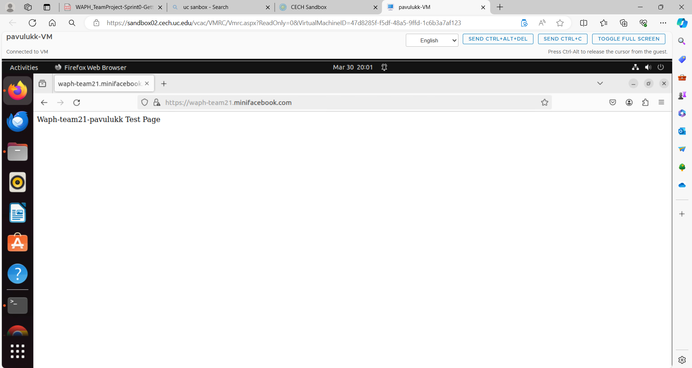

# WAPH-Web Application Programming and Hacking

## Instructor: Dr. Phu Phung

# Project Topic/Title: A MINI FACEBOOK

# Team members

1. Jaya Surya Ramisetty, ramiseja@mail.uc.edu
2. Karthik Pavuluri, pavulukk@mail.uc.edu
3. Purna Lokesh Reddy Chimalamarri, chimalpy@mail.uc.edu
4. Chakravarthi Maddi, maddici@mail.uc.edu

# Project Management Information

Source code repository (private access): (https://github.com/waph-team21/waph-teamproject.git)

Project homepage (public): (https://github.com/waph-team21/waph-team21.github.io.git)

## Revision History

| Date       |   Version     |  Description |
|------------|:-------------:|-------------:|
| 14/04/2024 |  0.0          | Sprint 0  |


# Software Process Management

_(Start from Sprint 0, keep updating)_

Introduce how your team uses a software management process, e.g., Scrum, and how your teamwork collaborates.

## Scrum process

### Sprint 0

Duration: 03/24/24-04/14/24

#### Completed Tasks: 

Task 1
completed creating SSL Key/certificate and established HTTPS and team localdomain name as waph-team21.minifacebook.com
Designed teamdatabase as waph_team21  
Task 2
Formatted and copied code skeleton form Lab3 to team repo waph-team21,commited the code together with README.md and index.html

#### Contributions: 

1. Member 1,  Completed creating an organization on github as waph-team21 added professor Dr.Phu Phung and other team members 5 commits, 2 hours, contributed in task-1
2. Member 2, Karthik Pavuluri created a public repository to host team project website, named as waph-team21.github.io 3 commits, 2 hours, contributed in task-2
3. Member 3,Purna Lokesh Reddy Chimalamarri contributed by checking waph-team21.github.io repository by adding index.html template 3 commits, 2 hours, contributed in task-2
4. Chakravarthi Maddi checked out the waph-teamproject and added README.md template, 3 commits, 2 hours, contributed in task-2

#### Screenshots:
- Team21 Login


- Member 1


- Member 2


- Member 3


- Member 4


# Appendix

We have included the Index.html and aslo created the database in the repository.

### Sprint 1

Duration: 03/31/2024-04/22/2024

#### Completed Tasks: 
1. User Registration: 
- Created a form for new users to fill out in order to register.
- Carried out input validation for the registration form both front-end and back-end.
- Included the logic required to save the registered user's data (password, username, etc.) in the database.

2. User Login: 
- Provided a form for logged-in users to complete.
- Validated data on the login form both on the front and back ends.
-Incorporated the logic required to validate the user's credentials against the database.
- Established session management for users who are logged in.

3. Change Password:
- Added a functionality that allows users who are logged in to alter their password.
-Validated data on both the front and back ends for the password change form.
- Included the logic required to update the database with the user's password.
  
4. Edit User Profile: 
- Provided an option for users who are logged in to modify the details (name, extra email address, phone number) in their profiles.
- Validated input on both the front and back ends of the edit profile form.
- Included the logic required to update the user's database profile information.

5. View Posts:
- Create a functionality that allows users who are signed in to access posts stored in the database.
- Used Prepared Statements to retrieve and show the posts from the database.
- Make that the data is properly sanitized and escaped.

6. Database Design and Implementation: 
- Modified the schema of the database to reflect the additional features (posts and user profiles, for example).
- Added the modified schema and sample data to the database-data.sql file.


#### Contributions: 

Member1: Jaya Surya Ramisetty

-Implemented the function for user registration.
- Front-end input validation was used when creating the registration form.
-Managed the database insertion and back-end logic for user registration.

Member 2: Karthik Pavuluri
- Put the user login function into place.
- Front-end input validation was used when creating the login form.
-Coordinated the session management and back-end logic for user authentication.

Member 3: Purna Lokesh  Chimalamarri
- Added the ability for users who are logged in to modify their passwords.
- A front-end input validation form for changing passwords was created.
- Managed the database's back-end logic for changing the user's password.

Member 4: Chakri Maddi
- Added the ability for logged-in users to change their user profiles.
- Front-end input validation was used when creating the edit profile form.
- Responsible for the back-end logic for updating the database with the user's profile information.

#### Sprint Retrospection:


| Good     |   Could have been better    |  How to improve?  |
|----------|:---------------------------:|------------------:|
|Excellent and new understanding of csrf implementation,as well as excellent teamwork|Need to work on styling                             |                   |


## Screenshots:


## Video demonstration:

[sprint1.webm](https://github.com/waph-team21/waph-team21.github.io/assets/148711687/4d16fdd1-e5f0-46e9-936d-91056923fe70)


### Sprint 2:

Duration: 04/16/2024-04/22/2024

#### Completed Tasks: 


1. **Design and Implementation of Databases**
   - Completed the database architecture for the newly created `posts} and `comments` tables.
   - Added the CREATE TABLE statements for the new tables to the `database-data.sql` file.
   - Established the connections between the recently created `posts` and `comments` tables and the current `users` table.

2. **Add New Post**
   - Developed a front-end form (newpost.php}, for example) that allows users to submit new posts; - Added client-side input validation to the form fields
   - To manage the form submission, a back-end script (such as `addnewpost.php`) was created.
   - Using prepared statements, write the PHP code to insert the new post data into the `posts` table.
   - Added CSRF security to the form submission.
3.  **view  Posts**
- To get and show all posts from the `posts` table, a PHP script (such as `viewposts.php}) was created.
- Prepared statements were then used to query the database and retrieve the post data. 
- The output was sanitized to prevent XSS vulnerabilities.

4. **Add Comment**
- In order to allow users to comment on posts, a front-end form was created (for example, in `viewposts.php}). 
- Client-side input validation was then implemented for the comment field. PHP code was then written to insert the new comment data into the `comments` database using prepared statements.
-  Added CSRF security to the form submission

5. **Revise/Cancel Post**
- Created a script that allows logged-in users to edit their own posts.
- Updated the post data in the posts database with prepared statements by writing PHP code.
- Implemented input validation and CSRF protection for the edit form.
- Added CSRF protection to the delete action.
- Developed a script that enables logged-in users to remove their own posts.
- Composed the PHP code to remove the post from the posts database using prepared statements.

6. **Access Control**
- To guarantee that users can only modify or remove their own postings, access control checks were included.
- Blocked users from reading or editing content that other users had posted.


#### Contributions: 

**Member 1** (Surya Ramisetty)
1. Completed the `posts` and `comments` tables' database design.
2. Added the CREATE TABLE statements for the new tables to the `database-data.sql` file.
3. Added server-side input validation and created the `addnewpost.php` statements needed to enter new posts.
4. CSRF protection was put into place for the newly submitted post form.

**Member 2** (Karthik Pavuluri)
1. Developed the `newpost.php` front-end form for new post submissions;
2. Added client-side input validation to the new post form
3. Developed the PHP script `viewposts.php` table; 
4. Put server-side prepared statements into practice to retrieve and show post data; 
5. Sanitized the output to avoid cross-site scripting vulnerabilities.

**Member 3** (Purna Lokesh Chimalamarri)
1. Made the front-end comment submission form (inside of `viewposts.php}).
2. Configured the comment form using client-side input validation.
3. Created statements for adding additional comments and implemented server-side input validation.
4. Added CSRF protection to the submission of the comment form

**Member 4** (Chakri Maddi)
1. Wrote the `editpost.php} script to allow for post editing; 2. Added client-side input validation to the edit post form; 3. Added server-side input validation and made statements for post data updates.
4. CSRF protection was put in place for the edit post form submission.
5. Developed the `deletepost.php` script to remove postings.
6. CSRF protection was implemented for the delete post operation. 7. Server-side prepared statements were implemented to remove posts from the {posts} table.

## Screenshots:


#### Sprint Retrospection:

| Good | Could have been better | How to improve? |
|----------|:---------------------------:|------------------:|
| Good communication and collaboration within the team | Delayed start on some tasks due to other commitments | Better time management and setting realistic deadlines |
| Successful implementation of core features (adding/viewing posts, comments) | Code quality and organization could be improved | Establishing  coding standards and guidelines, conducting peer code reviews |
| Effective use of version control system (Git) | Insufficient testing and debugging | Allocate more time for thorough testing, implement automated tests |
|  | Incomplete documentation | Assign specific team members for documentation updates after each task |
|  | Difficulties in integrating individual contributions | Plan integration points and schedule merge meetings regularly |


# Appendix
Source code repository (private access): (https://github.com/waph-team21/waph-teamproject.git)

Project homepage (public): (https://github.com/waph-team21/waph-team21.github.io.git)

Code for the database-data.sql:
```sql


DROP TABLE IF EXISTS users;

CREATE TABLE users (
    username VARCHAR(30) PRIMARY KEY,
    password VARCHAR(50) NOT NULL,
    fullname VARCHAR(50) NOT NULL,
    mail VARCHAR(50) NOT NULL,
    phone VARCHAR(20),
    profile_disabled BOOLEAN NOT NULL DEFAULT FALSE
);

CREATE TABLE superusers (
    username VARCHAR(255) PRIMARY KEY,
    password VARCHAR(255) NOT NULL,
    name VARCHAR(255) NOT NULL,
    additional_email VARCHAR(255),
    phone VARCHAR(20),
    profile_disabled BOOLEAN NOT NULL DEFAULT FALSE
);


CREATE TABLE messages (
    message_ID SERIAL PRIMARY KEY,
    content TEXT NOT NULL,
    type VARCHAR(50),
    timestamp TIMESTAMP NOT NULL DEFAULT CURRENT_TIMESTAMP,
    sender_username VARCHAR(255),
    receiver_username VARCHAR(255),
    FOREIGN KEY (sender_username) REFERENCES users(username),
    FOREIGN KEY (receiver_username) REFERENCES users(username)
);

CREATE TABLE posts (
    post_ID SERIAL PRIMARY KEY,
    owner VARCHAR(255),
    content TEXT NOT NULL,
    timestamp TIMESTAMP NOT NULL DEFAULT CURRENT_TIMESTAMP,
    FOREIGN KEY (owner) REFERENCES users(username)
);


CREATE TABLE comments (
    comment_ID BIGINT UNSIGNED AUTO_INCREMENT PRIMARY KEY,
    post_ID BIGINT UNSIGNED NOT NULL,  -- Matching type with `post_ID` in `posts`
    username VARCHAR(255) NOT NULL,
    comment TEXT NOT NULL,
    timestamp TIMESTAMP NOT NULL DEFAULT CURRENT_TIMESTAMP,
    FOREIGN KEY (post_ID) REFERENCES posts(post_ID)
        ON DELETE CASCADE
        ON UPDATE CASCADE,
    FOREIGN KEY (username) REFERENCES users(username)
        ON DELETE CASCADE
        ON UPDATE CASCADE
) ENGINE=InnoDB;
```
code for the database-account.sql:
```sql

CREATE DATABASE IF NOT EXISTS waph_team21;
DROP USER IF EXISTS 'team21'@'localhost';
CREATE USER 'team21'@'localhost' IDENTIFIED BY 'Pa$$w0rd';
GRANT ALL ON waph_team21.* TO 'team21'@'localhost';
```
code for index.php:
```php
<!DOCTYPE html>
<html lang="en">
<head>
  <meta charset="utf-8">
  <title>Welcome</title>
  <style>
    body {
      font-family: 'Roboto', sans-serif;
      background-color: #f0f0f0;
      margin: 0;
      padding: 0;
    }
    .container {
      max-width: 500px;
      margin: 50px auto;
      padding: 30px;
      background-color: #ffffff;
      border-radius: 8px;
      box-shadow: 0 0 20px rgba(0, 0, 0, 0.1);
      text-align: center;
    }
    h1 {
      color: #2196f3;
    }
    h2 {
      color: #333;
      margin-bottom: 20px;
    }
    #digit-clock {
      font-size: 16px;
      color: #888;
      margin-bottom: 20px;
    }
    .form {
      margin-top: 20px;
    }
    .text_field {
      width: calc(100% - 24px);
      padding: 12px;
      margin-top: 10px;
      border: 1px solid #ccc;
      border-radius: 25px;
      box-shadow: none;
      transition: border-color 0.3s ease;
    }
    .text_field:focus {
      border-color: #2196f3;
    }
    .button {
      display: inline-block;
      padding: 15px 30px;
      margin-top: 20px;
      background-color: #2196f3;
      color: white;
      border: none;
      border-radius: 25px;
      cursor: pointer;
      transition: background-color 0.3s ease, transform 0.2s ease;
    }
    .button:hover {
      background-color: #0c7cd5;
      transform: translateY(-3px);
    }
  </style>
</head>
<body>
<?php
    //session_set_cookie_params(15*60,"/","waph-team21.minifacebook.com",TRUE,TRUE);
	session_start(); 
	if (isset($_POST["username"]) and isset($_POST["password"])) {

	    if (checklogin_mysql($_POST["username"],$_POST["password"])) {

		    $_SESSION['authenticated'] = TRUE;
		    $_SESSION['username']= $_POST["username"];
		//$sanitized_username = htmlspecialchars($_POST['username'])
	    }else{
		    session_destroy();
		    echo "<script>alert('Invalid username/password');window.location='form.php';</script>";
		    die();
	}
}
	if (!isset($_SESSION['authenticated']) or $_SESSION['authenticated']!= TRUE){
	 session_destroy();
	 echo "<script>alert('you have not login.please login')</script>";
	 header("Refresh: 0; url=form.php");
	 die();
	}
	if (!isset($_SESSION['authenticated']) || $_SESSION['authenticated'] !== true) {
    echo "<script>alert('Not authorized. Please login first.'); window.location='form.php';</script>";
    exit;
}

$userProfile = getUserProfile($_SESSION['username']);

function getUserProfile($username) {
    $mysqli = new mysqli('localhost', 'team21', 'Pa$$w0rd', 'waph_team21');
    if ($mysqli->connect_errno) {
        echo "Database connection failed: " . $mysqli->connect_error;
        exit();
    }

    $sql = "SELECT * FROM users WHERE username=?";
    $stmt = $mysqli->prepare($sql);
    $stmt->bind_param("s", $username);
    $stmt->execute();
    $result = $stmt->get_result();
    return $result->fetch_assoc();
}
	/*if($_SESSION['browser'] != $_SERVER['HTTP_USER_AGENT']){
		session_destroy();
		echo "<script>alert('session hijacking attack is detected!');</script>";
		header("Refresh:0; url=form.php");
		die();
	}*/

	/*function checklogin($username, $password) {
		$account = array("admin","1234");
		if (($username== $account[0]) and ($password == $account[1])) 
		  return TRUE;
		else 
		  return FALSE;
  	}*/

  	function checklogin_mysql($username,$password){
  		$mysqli = new mysqli('localhost','team21','Pa$$w0rd','waph_team21');
  		if($mysqli->connect_errno){
  			printf("Database connection failed : %s\n", $mysqli->connect-error);
  			exit();

  		}
  	$sql = "SELECT * FROM users WHERE username= ? AND password = md5(?)";
  	$stmt = $mysqli->prepare($sql);
  	$stmt->bind_param("ss",$username,$password);
  	$stmt->execute();
  	$result=$stmt->get_result();
  	if($result->num_rows == 1)
  		return TRUE;
  	return FALSE;
  	}


?>
  <div class="container">
    <h2>Welcome <?php echo htmlentities($_SESSION['username']); ?>!</h2>
    <p>Email: <?php echo htmlentities($userProfile['email']); ?></p>
    <p>Name: <?php echo htmlentities($userProfile['name']); ?></p>
    <p>Phone: <?php echo htmlentities($userProfile['phone']); ?></p>

    <div class="button-container">
      <a class="button" href="changepasswordform.php">Change Password</a>
      <a class="button" href="updatedetails.php">Change Details</a>
      <a class="button" href="logout.php">Logout</a>
      <a class="button" href="view_post.php">View Posts</a>
      <a class="button" href="create_post.php">Create Post</a>
      <a class="button" href="update_post.php">Update Post</a>
      <a class="button" href="delete_post.php">Delete Post</a>
    </div>
  </div>
</body>
</html>
```
Code for form.php:
``` php 
<!DOCTYPE html>
<html lang="en">
<head>
  <meta charset="utf-8">
  <title>Welcome</title>
  <style>
    body {
      font-family: 'Roboto', sans-serif;
      background-color: #f0f0f0;
      margin: 0;
      padding: 0;
    }
    .container {
      max-width: 500px;
      margin: 50px auto;
      padding: 30px;
      background-color: #ffffff;
      border-radius: 8px;
      box-shadow: 0 0 20px rgba(0, 0, 0, 0.1);
      text-align: center;
    }
    h1 {
      color: #2196f3;
    }
    h2 {
      color: #333;
      margin-bottom: 20px;
    }
    #digit-clock {
      font-size: 16px;
      color: #888;
      margin-bottom: 20px;
    }
    .form {
      margin-top: 20px;
    }
    .text_field {
      width: calc(100% - 24px);
      padding: 12px;
      margin-top: 10px;
      border: 1px solid #ccc;
      border-radius: 25px;
      box-shadow: none;
      transition: border-color 0.3s ease;
    }
    .text_field:focus {
      border-color: #2196f3;
    }
    .button {
      display: inline-block;
      padding: 15px 30px;
      margin-top: 20px;
      background-color: #2196f3;
      color: white;
      border: none;
      border-radius: 25px;
      cursor: pointer;
      transition: background-color 0.3s ease, transform 0.2s ease;
    }
    .button:hover {
      background-color: #0c7cd5;
      transform: translateY(-3px);
    }
  </style>
</head>
<body>
<?php
    //session_set_cookie_params(15*60,"/","waph-team21.minifacebook.com",TRUE,TRUE);
	session_start(); 
	if (isset($_POST["username"]) and isset($_POST["password"])) {

	    if (checklogin_mysql($_POST["username"],$_POST["password"])) {

		    $_SESSION['authenticated'] = TRUE;
		    $_SESSION['username']= $_POST["username"];
		//$sanitized_username = htmlspecialchars($_POST['username'])
	    }else{
		    session_destroy();
		    echo "<script>alert('Invalid username/password');window.location='form.php';</script>";
		    die();
	}
}
	if (!isset($_SESSION['authenticated']) or $_SESSION['authenticated']!= TRUE){
	 session_destroy();
	 echo "<script>alert('you have not login.please login')</script>";
	 header("Refresh: 0; url=form.php");
	 die();
	}
	if (!isset($_SESSION['authenticated']) || $_SESSION['authenticated'] !== true) {
    echo "<script>alert('Not authorized. Please login first.'); window.location='form.php';</script>";
    exit;
}

$userProfile = getUserProfile($_SESSION['username']);

function getUserProfile($username) {
    $mysqli = new mysqli('localhost', 'team21', 'Pa$$w0rd', 'waph_team21');
    if ($mysqli->connect_errno) {
        echo "Database connection failed: " . $mysqli->connect_error;
        exit();
    }

    $sql = "SELECT * FROM users WHERE username=?";
    $stmt = $mysqli->prepare($sql);
    $stmt->bind_param("s", $username);
    $stmt->execute();
    $result = $stmt->get_result();
    return $result->fetch_assoc();
}
	/*if($_SESSION['browser'] != $_SERVER['HTTP_USER_AGENT']){
		session_destroy();
		echo "<script>alert('session hijacking attack is detected!');</script>";
		header("Refresh:0; url=form.php");
		die();
	}*/

	/*function checklogin($username, $password) {
		$account = array("admin","1234");
		if (($username== $account[0]) and ($password == $account[1])) 
		  return TRUE;
		else 
		  return FALSE;
  	}*/

  	function checklogin_mysql($username,$password){
  		$mysqli = new mysqli('localhost','team21','Pa$$w0rd','waph_team21');
  		if($mysqli->connect_errno){
  			printf("Database connection failed : %s\n", $mysqli->connect-error);
  			exit();

  		}
  	$sql = "SELECT * FROM users WHERE username= ? AND password = md5(?)";
  	$stmt = $mysqli->prepare($sql);
  	$stmt->bind_param("ss",$username,$password);
  	$stmt->execute();
  	$result=$stmt->get_result();
  	if($result->num_rows == 1)
  		return TRUE;
  	return FALSE;
  	}


?>
  <div class="container">
    <h2>Welcome <?php echo htmlentities($_SESSION['username']); ?>!</h2>
    <p>Email: <?php echo htmlentities($userProfile['email']); ?></p>
    <p>Name: <?php echo htmlentities($userProfile['name']); ?></p>
    <p>Phone: <?php echo htmlentities($userProfile['phone']); ?></p>

    <div class="button-container">
      <a class="button" href="changepasswordform.php">Change Password</a>
      <a class="button" href="updatedetails.php">Change Details</a>
      <a class="button" href="logout.php">Logout</a>
      <a class="button" href="view_post.php">View Posts</a>
      <a class="button" href="create_post.php">Create Post</a>
      <a class="button" href="update_post.php">Update Post</a>
      <a class="button" href="delete_post.php">Delete Post</a>
    </div>
  </div>
</body>
</html>

```
Video Demonstration for Sprint 2:

[sprint2.webm](https://github.com/waph-team21/waph-team21.github.io/assets/148711687/34b88d78-cdb6-46c9-8ae3-e278c0af2745)
