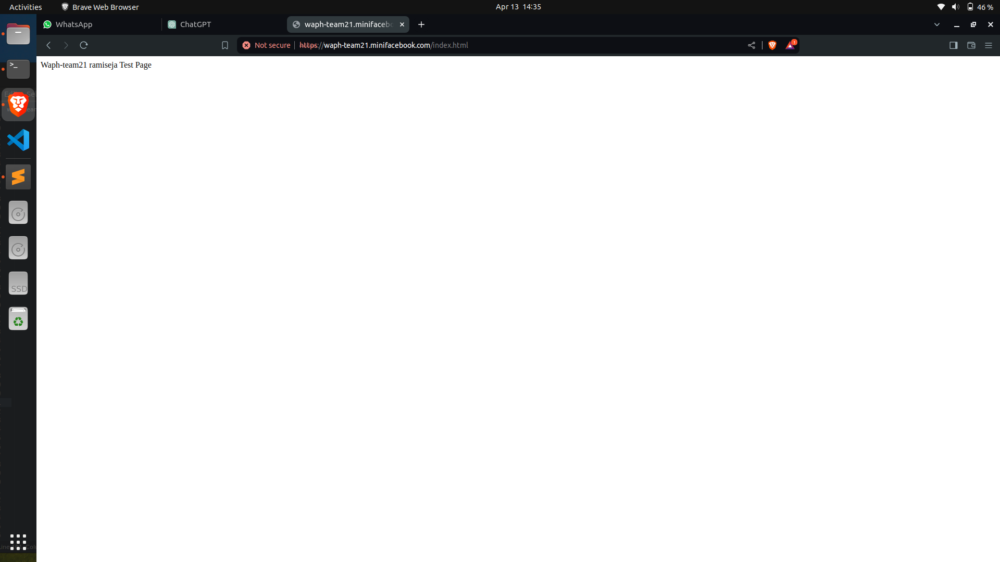

# WAPH-Web Application Programming and Hacking

## Instructor: Dr. Phu Phung

# Project Topic/Title: A MINI FACEBOOK

# Team members

1. Jaya Surya Ramisetty, ramiseja@mail.uc.edu
2. Karthik Pavuluri, pavulukk@mail.uc.edu
3. Purna Lokesh Reddy Chimalamarri, chimalpy@mail.uc.edu
4. Chakravarthi Maddi, maddici@mail.uc.edu

# Project Management Information

Source code repository (private access): (https://github.com/waph-team21/waph-teamproject.git)

Project homepage (public): (https://github.com/waph-team21/waph-team21.github.io.git)

## Revision History

| Date       |   Version     |  Description |
|------------|:-------------:|-------------:|
| 14/04/2024 |  0.0          | Sprint 0  |

# Software Process Management

_(Start from Sprint 0, keep updating)_

Introduce how your team uses a software management process, e.g., Scrum, and how your teamwork collaborates.

## Scrum process

### Sprint 0

Duration: 03/24/24-04/14/24

#### Completed Tasks: 

Task 1
completed creating SSL Key/certificate and established HTTPS and team localdomain name as waph-team21.minifacebook.com
Designed teamdatabase as waph_team21  
Task 2
Formatted and copied code skeleton form Lab3 to team repo waph-team21,commited the code together with README.md and index.html

#### Contributions: 

1. Member 1,  Completed creating an organization on github as waph-team21 added professor Dr.Phu Phung and other team members 5 commits, 2 hours, contributed in task-1
2. Member 2, Karthik Pavuluri created a public repository to host team project website, named as waph-team21.github.io 3 commits, 2 hours, contributed in task-2
3. Member 3,Purna Lokesh Reddy Chimalamarri contributed by checking waph-team21.github.io repository by adding index.html template 3 commits, 2 hours, contributed in task-2
4. Chakravarthi Maddi checked out the waph-teamproject and added README.md template, 3 commits, 2 hours, contributed in task-2

#### Screenshots:
- Team21 Login

- Member 1

- Member 2

- Member 3

- Member 4

# Appendix

We have included the Index.html and aslo created the database in the repository.

### Sprint 1

Duration: MM/DD/YYYY-MM/DD/YYYY

#### Completed Tasks: 

### Sprint x

Duration: MM/DD/YYYY-MM/DD/YYYY

#### Completed Tasks: 
1. User Registration: 
- Created a form for new users to fill out in order to register.
- Carried out input validation for the registration form both front-end and back-end.
- Included the logic required to save the registered user's data (password, username, etc.) in the database.

2. User Login: 
- Provided a form for logged-in users to complete.
- Validated data on the login form both on the front and back ends.
-Incorporated the logic required to validate the user's credentials against the database.
- Established session management for users who are logged in.

3. Change Password:
- Added a functionality that allows users who are logged in to alter their password.
-Validated data on both the front and back ends for the password change form.
- Included the logic required to update the database with the user's password.
- 
4. Edit User Profile: 
- Provided an option for users who are logged in to modify the details (name, extra email address, phone number) in their profiles.
- Validated input on both the front and back ends of the edit profile form.
- Included the logic required to update the user's database profile information.

5. View Posts:
- Create a functionality that allows users who are signed in to access posts stored in the database.
- Used Prepared Statements to retrieve and show the posts from the database.
-Make that the data is properly sanitized and escaped.

7. Database Design and Implementation: 
- Modified the schema of the database to reflect the additional features (posts and user profiles, for example).
- Added the modified schema and sample data to the database-data.sql file.

  
#### Contributions: 

1. Member 1, x commits, y hours, contributed in xxx
2. Member 2, x commits, y hours, contributed in xxx
3. Member 3, x commits, y hours, contributed in xxx
4. Member 4, x commits, y hours, contributed in xxx
#### Contributions: 

1. Member 1, x commits, y hours, contributed in xxx
2. Member 2, x commits, y hours, contributed in xxx
3. Member 3, x commits, y hours, contributed in xxx
4. Member 4, x commits, y hours, contributed in xxx

