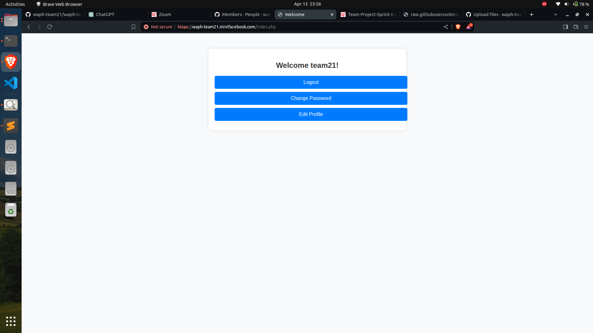
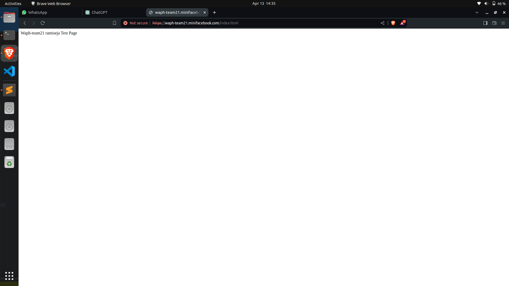
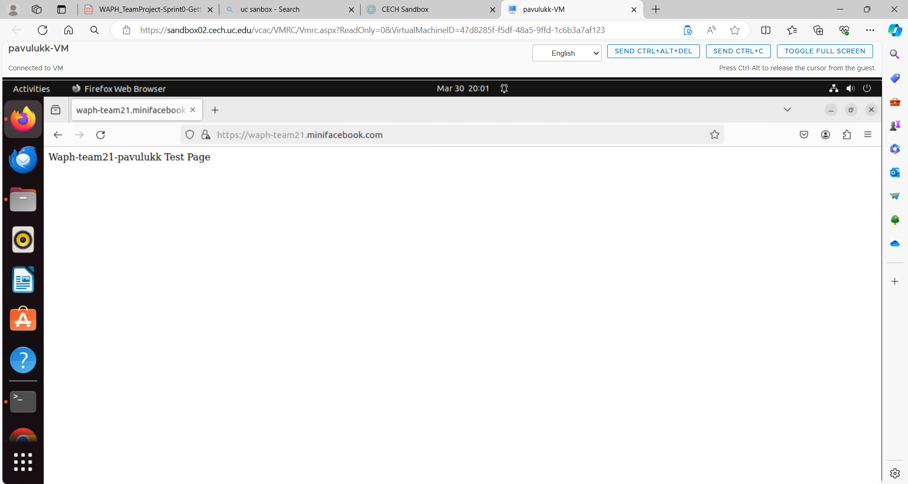
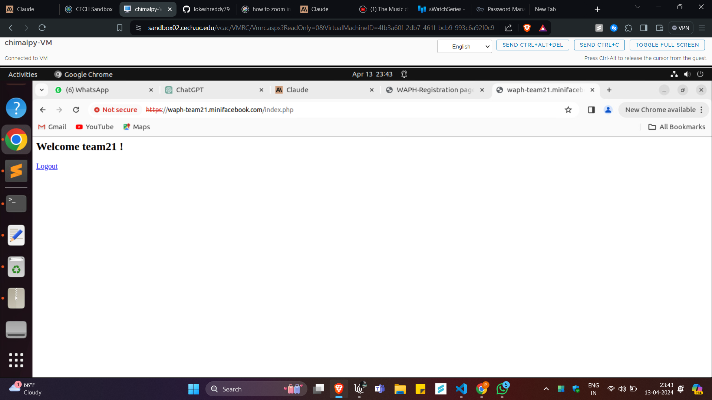
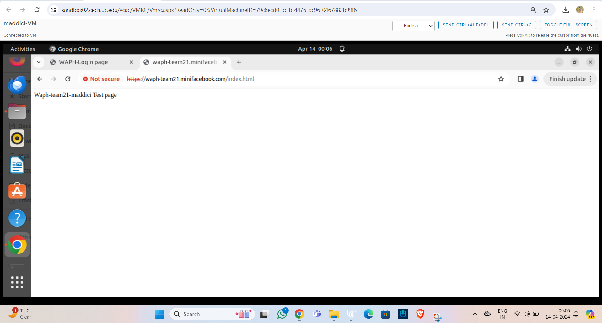

# WAPH-Web Application Programming and Hacking

## Instructor: Dr. Phu Phung

# Project Topic/Title: A MINI FACEBOOK

# Team members

1. Jaya Surya Ramisetty, ramiseja@mail.uc.edu
2. Purna Lokesh Reddy Chimalamarri, chimalpy@mail.uc.edu
3. Karthik Pavuluri, pavulukk@mail.uc.edu
4. Chakravarthi Maddi, maddici@mail.uc.edu

# Project Management Information

Source code repository (private access): (https://github.com/waph-team21/waph-teamproject.git)

Project homepage (public): (https://github.com/waph-team21/waph-team21.github.io.git)

## Revision History

| Date       |   Version     |  Description |
|------------|:-------------:|-------------:|
| 14/04/2024 |  0.0          | Sprint 0  |

# Software Process Management

_(Start from Sprint 0, keep updating)_

Introduce how your team uses a software management process, e.g., Scrum, and how your teamwork collaborates.

## Scrum process

### Sprint 0

Duration: DD/MM/YYYY-DD/MM/YYYY

#### Completed Tasks: 

Task 1
completed creating SSL Key/certificate and established HTTPS and team localdomain name as waph-team21.minifacebook.com
Designed teamdatabase as waph_team21  
Task 2
Formatted and copied code skeleton form Lab3 to team repo waph-team21,commited the code together with README.md and index.html

#### Contributions: 

1. Member 1,  Completed creating an organization on github as waph-team21 added professor Dr.Phu Phung and other team members 5 commits, 2 hours, contributed in task-1
2. Member 2, Karthik Pavuluri created a public repository to host team project website, named as waph-team21.github.io 3 commits, 2 hours, contributed in task-2
3. Member 3,Purna Lokesh Reddy Chimalamarri contributed by checking waph-team21.github.io repository by adding index.html template 3 commits, 2 hours, contributed in task-2
4. Chakravarthi Maddi checked out the waph-teamproject and added README.md template, 3 commits, 2 hours, contributed in task-2

#### Screenshots:
- Team21 Login

- Member 1

- Member 2

- Member 3

- Member 4

# Appendix

Include the content (in text, not as images) of the SQL files and all source code of your PHP files (with the file name). 
